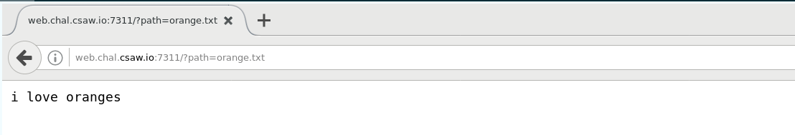

# Description

This was part of the web challenges and they gave us this information
```
orange v1

I wrote a little proxy program in NodeJS for my poems folder.

Everyone wants to read flag.txt but I like it too much to share.

http://web.chal.csaw.io:7311/?path=orange.txt
```

If we browse to that URL we get a simple text output, there is not much going all.



If we pass "./" to the path variable we get all the files of the current directory (orange) that make sense
with the original challenge description:


There is no flag.txt file in that directory, lets check if we are able to list the files in the upper 
directory:


It seems there is a filtering mechanism in place that prevents us to use the ".." string, if we encode
the string as %2e%2e%2f (../) per example we still get blocked and using some of the utf-8 encodings
available was not possible ...

... After using a double encoding process we were able to not get banned, however there was nothing listed:


Lets try to append flag.txt at the end since that was one of the hints, we will end with something like:
```
http://web.chal.csaw.io:7311/?path=%252e%252e%252fflag.txt
```

At the end the flag was:

```
flag{thank_you_based_orange_for_this_ctf_challenge}
```

