# CyberEx #
The International CyberEx is an initiative of OAS, INCIBE and CNPIC that seeks to strengthen
the ability to respond to cyber incidents, as well as to improve collaboration and cooperation
in this kind of incidents.

# Overview #
This would be the part in which we jump straight to the write-up of the challenges, however,
this CTF was kind of an unique experience so we would like to comment on how the CTF was developed.

We started the CTF with a set of challenges that were hosted in a virtual environment, the
organizers gave 8 machines to each team, 4 of them hosted the challenges and the remaining
4 machines had a Kali running on them, those were used as attacking platform for each member of
the team and could be accessed via desktop streaming over https, however, the environment was very
unreliable and a lot of teams suffered disconnections and very high latency on the desktop
streaming, during this we were able to solve a 200 points challenge on the first hour and
after that we were not able to work because of these issues.

To solve this the organizers had to deploy mid competition a secondary environment with a new
set of challenges, this time it was more inline with how jeopardy style CTFs are run where you 
can download the challenges and work on them offline in your own machine.

I know that it takes a lot of effort to build a CTF platform and challenges, but if I can give
my 2 cents to the organizers it would be:

* Allow the players to use their own machines and tools, you guys will save a lot of resources.
* Have a flag format like other major CTFs, if there is a need to have a different flag format, the expected
format should be added in the challenge description, per example: the flag should be username:password or
IP in the format xxx.xxx.xxx.xxx.

# Challenges #

## 1. Where am I? ##

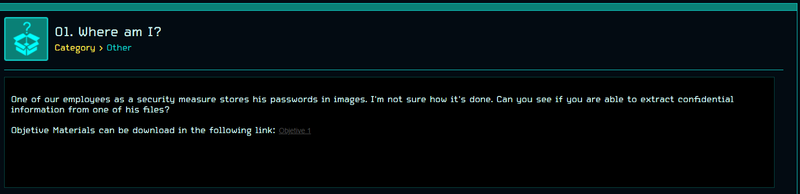

This seems like a steganography challenge, once we extracted the Objective\_1.v1.0.zip file
we ended with the file cat.jpg.

```
❯ file cat.jpg
cat.jpg: JPEG image data, JFIF standard 1.01, aspect ratio, density 1x1, segment length 16, baseline, precision 8, 1536x864, components 3
```
We started with stegsolve.jar and after testing some methods like alpha LSB/MSB we shifted to
steghide, however, we need a passphrase to be able to extract the data.
```
❯ steghide extract -sf cat.jpg
Enter passphrase:
```
After testing some random passwords without any luck, we used stegcracker to expedite the process.
We used the rockyou dictionary since it has most common passwords.
```
❯ stegcracker cat.jpg rockyou.txt
StegCracker 2.0.7 - (https://github.com/Paradoxis/StegCracker)
Copyright (c) 2019 - Luke Paris (Paradoxis)

Counting lines in wordlist..
Attacking file 'cat.jpg' with wordlist 'rockyou.txt'..
Successfully cracked file with password: austin1
Tried 1668 passwords
Your file has been written to: cat.jpg.out
austin1
```
If we check our output file we will see our flag.

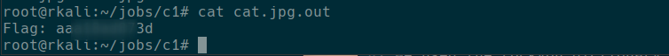

## 2. Magic Byte ##

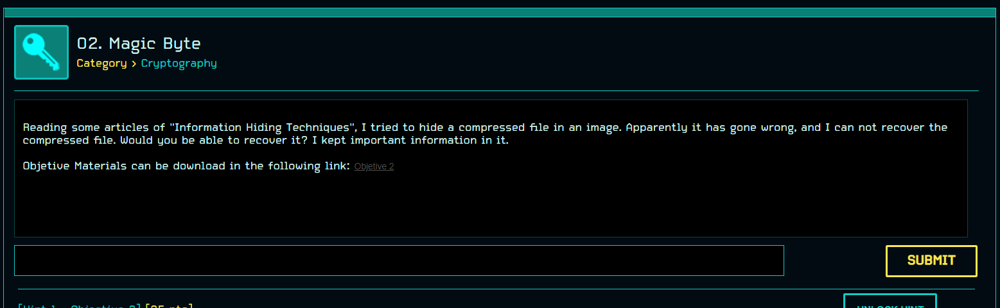

After extracting the file Objective\_2\_v1.0.zip we ended with a jpeg file.
```
❯ file take_a_look.jpg
take_a_look.jpg: JPEG image data, JFIF standard 1.01, aspect ratio, density 1x1, segment length 16, baseline, precision 8, 960x604, components 3
```
From the description of this challenge it seems that we need to extract some file from the image,
we ran binwalk to verify if there is any other file embedded in the JPEG file.
```
❯ binwalk take_a_look.jpg

DECIMAL       HEXADECIMAL     DESCRIPTION
--------------------------------------------------------------------------------
0             0x0             JPEG image data, JFIF standard 1.01
69262         0x10E8E         End of Zip archive, footer length: 22
```
There seems to be some kind of zip file, however, if we attempt to extract it with binwalk (flag -e)
we are not able to do so. We used zipinfo to get more information about this embedded zip file.
```
❯ zipinfo -lv take_a_look.jpg
Archive:  take_a_look.jpg
There is no zipfile comment.

End-of-central-directory record:
-------------------------------

  Zip archive file size:                     69284 (0000000000010EA4h)
  Actual end-cent-dir record offset:         69262 (0000000000010E8Eh)
  Expected end-cent-dir record offset:         190 (00000000000000BEh)
  (based on the length of the central directory and its expected offset)

  This zipfile constitutes the sole disk of a single-part archive; its
  central directory contains 1 entry.
  The central directory is 78 (000000000000004Eh) bytes long,
  and its (expected) offset in bytes from the beginning of the zipfile
  is 112 (0000000000000070h).

warning [take_a_look.jpg]:  69072 extra bytes at beginning or within zipfile
  (attempting to process anyway)

Central directory entry #1:
---------------------------

  flag.txt

  offset of local header from start of archive:   0
                                                  (0000000000000000h) bytes
  file system or operating system of origin:      Unix
  version of encoding software:                   3.0
  minimum file system compatibility required:     MS-DOS, OS/2 or NT FAT
  minimum software version required to extract:   1.0
  compression method:                             none (stored)
  file security status:                           encrypted
  extended local header:                          yes
  file last modified on (DOS date/time):          2019 Jul 10 12:48:38
  file last modified on (UT extra field modtime): 2019 Jul 10 05:48:37 local
  file last modified on (UT extra field modtime): 2019 Jul 10 11:48:37 UTC
  32-bit CRC value (hex):                         59e79364
  compressed size:                                30 bytes
  uncompressed size:                              18 bytes
  length of filename:                             8 characters
  length of extra field:                          24 bytes
  length of file comment:                         0 characters
  disk number on which file begins:               disk 1
  apparent file type:                             text
  Unix file attributes (100644 octal):            -rw-r--r--
  MS-DOS file attributes (00 hex):                none

  The central-directory extra field contains:
  - A subfield with ID 0x5455 (universal time) and 5 data bytes.
    The local extra field has UTC/GMT modification/access times.
  - A subfield with ID 0x7875 (Unix UID/GID (any size)) and 11 data bytes:
    01 04 00 00 00 00 04 00 00 00 00.

  There is no file comment.
```
The output of zipinfo revealed a file called flag.txt inside this zip file, but as we can
see the zip file is corrupted in some way. According to zipinfo the end of the central directory
should be at offset 0x10E8E.

If we check with radare2 that offset, indeed we have the end of central directory there ...
```
[0x00000000]> s 0x10e8e
[0x00010e8e]> px 10
- offset -   0 1  2 3  4 5  6 7  8 9  A B  C D  E F  0123456789ABCDEF
0x00010e8e  504b 0506 0000 0000 0100                 PK........

```
If we now subtract the expected central directory size (0x4e) we should land in the start
of the central directory.
```
[0x00010e8e]> s -0x4e
[0x00010e40]> px 32
- offset -   0 1  2 3  4 5  6 7  8 9  A B  C D  E F  0123456789ABCDEF
0x00010e40  504b 0102 1e03 0a00 0900 0000 1366 ea4e  PK...........f.N
0x00010e50  6493 e759 1e00 0000 1200 0000 0800 1800  d..Y............
```
The bytes 0x50 0x4b 0x01 0x02 define the start of the central directory, relying again on the
information provided by zipinfo we now move back 0x70 (expected offset of the central directory
from the start of the zip file).
```
[0x00010e40]> s -0x70
[0x00010dd0]> px 32
- offset -   0 1  2 3  4 5  6 7  8 9  A B  C D  E F  0123456789ABCDEF
0x00010dd0  ff4b 0304 0a00 0900 0000 1366 ea4e 6493  .K.........f.Nd.
0x00010de0  e759 1e00 0000 1200 0000 0800 1c00 666c  .Y............fl
```
Now if we inspect closely the offset 0x10DD0 we can see the bytes 0xff 0x4b 0x03 0x04, if we
check the ZIP header standard this should be 0x50 0x4b 0x03 0x04, maybe this first byte (0xff)
is corrupting our entire zip file. We will modify this byte with 0x50 with radare2.
```
[0x00010dd0]> w P
[0x00010dd0]> px 32
- offset -   0 1  2 3  4 5  6 7  8 9  A B  C D  E F  0123456789ABCDEF
0x00010dd0  504b 0304 0a00 0900 0000 1366 ea4e 6493  PK.........f.Nd.
0x00010de0  e759 1e00 0000 1200 0000 0800 1c00 666c  .Y............fl
[0x00010dd0]> q
```
The ASCII P letter equals 0x50 in hex so we can write P at offset 0x10DD0, after exiting
radare2 and checking with binwalk again, no we can see a working zip file that is able to list
what files are archived inside it.
```
❯ binwalk take_a_look.jpg

DECIMAL       HEXADECIMAL     DESCRIPTION
--------------------------------------------------------------------------------
0             0x0             JPEG image data, JFIF standard 1.01
69072         0x10DD0         Zip archive data, encrypted at least v1.0 to extract, compressed size: 30, uncompressed size: 18, name: flag.txt
69262         0x10E8E         End of Zip archive, footer length: 22
```
If we extract the files with binwalk we end up with two files:
* 10DD0.zip: an encrypted zip file
* flag.txt: binwalk attempt to extract this file from the 10DD0.zip file

We attempted to extract the zip file and indeed it asked for a password.
```
unzip 10DD0.zip
Archive:  10DD0.zip
[10DD0.zip] flag.txt password:
```
At this point we thought that the challenge was over ... (very naive on our part), we started
doing the usual stuff, our first dictionary was rockyou.txt since it worked for us on the first
challenge (but after a few seconds we had no luck), we used other common dictionaries but none of
them worked, we started to get nervous and from here on we started to get of the rails from the
solution.

Since our common dictionaries did not work, we started to create our own dictionaries
(one of the hints stated that the name of the JPEG file could be useful) based on the name
of the JPEG file with crunch.

```
❯ crunch 11 11 take_a_look > take_a_look.dict
❯ crunch 4 10 take_a_look > take_a_look2.dict
```
These two files weighted a bit more of 25GB together we thought we had it now ...

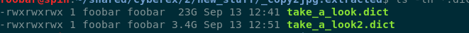

Thanks to hashcat and some nvidia GPUs we got laying around we could test this dictionaries
in minutes ...

```
Session..........: hashcat
Status...........: Exhausted
Hash.Name........: PKZIP (Uncompressed)
Hash.Target......: $pkzip2$1*2*2*0*1e*12*59e79364*0*42*0*1e*59e7*6613*...kzip2$
Time.Started.....: Tue Sep 11 17:05:06 2019 (2 mins, 59 secs)
Time.Estimated...: Sat Sep 11 17:08:05 2019 (0 secs)
Guess.Base.......: File (D:\shared\cyberex\c2\tak_a_look.dict)
Guess.Queue......: 1/1 (100.00%)
Speed.#1.........:  6245.5 kH/s (4.24ms) @ Accel:1024 Loops:1 Thr:64 Vec:1
Speed.#2.........:  4817.1 kH/s (6.28ms) @ Accel:1024 Loops:1 Thr:64 Vec:1
Speed.#*.........: 11062.7 kH/s
Recovered........: 0/1 (0.00%) Digests
Progress.........: 1977326743/1977326743 (100.00%)
Rejected.........: 0/1977326743 (0.00%)
Restore.Point....: 1976510618/1977326743 (99.96%)
Restore.Sub.#1...: Salt:0 Amplifier:0-1 Iteration:0-1
Restore.Sub.#2...: Salt:0 Amplifier:0-1 Iteration:0-1
Candidates.#1....: oooottet_kl -> ooooooooooo
Candidates.#2....: ooolalt_kk_ -> oooottet_k_
Hardware.Mon.#1..: Temp: 44c Fan: 25% Util:  6% Core:1515MHz Mem:6800MHz Bus:8
Hardware.Mon.#2..: Temp: 55c Fan: 35% Util: 11% Core:1607MHz Mem:4513MHz Bus:8
```

... after finishing the entire dictionaries there was 0/1 recovered hashes, we started to enter
panic mode ... and we thought: maybe, just maybe it is a random password (pretty unlikely for a
CTF challenge) but we went ahead and started going through different password lengths with
hashcat.
Going from length 4 to 6 was pretty easy, it was just a matter of minutes however testing random
passwords for length 7 required 40+ minutes.

```
❯ hashcat -a 3 -i --increment-min 8 -m 17210 zip.hashes ?a?a?a?a?a?a?a?a?a?a
```
We started to see our team drop from top 5 to top 10, but we checked the amount of time it
would take to test for passwords of 8 characters.

```
Session..........: hashcat
Status...........: Quit
Hash.Name........: PKZIP (Uncompressed)
Hash.Target......: $pkzip2$1*2*2*0*1e*12*59e79364*0*42*0*1e*59e7*6613*...kzip2$
Time.Started.....: Tue Sep 11 23:07:45 2019 (2 secs)
Time.Estimated...: Sat Sep 15 09:13:35 2019 (3 days, 10 hours)
Guess.Mask.......: ?a?a?a?a?a?a?a?a [8]
Guess.Queue......: 1/2 (50.00%)
Speed.#1.........: 13170.1 MH/s (56.64ms) @ Accel:64 Loops:256 Thr:1024 Vec:1
Speed.#2.........:  9276.9 MH/s (71.19ms) @ Accel:32 Loops:1024 Thr:1024 Vec:1
Speed.#*.........: 22447.0 MH/s
Recovered........: 0/1 (0.00%) Digests
Progress.........: 39258685440/6634204312890625 (0.00%)
Rejected.........: 0/39258685440 (0.00%)
Restore.Point....: 0/7737809375 (0.00%)
Restore.Sub.#1...: Salt:0 Amplifier:7680-7936 Iteration:0-256
Restore.Sub.#2...: Salt:0 Amplifier:24576-25600 Iteration:0-1024
Candidates.#1....: `UNerane -> N""34BIN
Candidates.#2....: .OOvo+ma -> T/o!Koss
Hardware.Mon.#1..: Temp: 47c Fan: 25% Util: 97% Core:1980MHz Mem:6800MHz Bus:8
Hardware.Mon.#2..: Temp: 48c Fan: 26% Util: 99% Core:1835MHz Mem:4513MHz Bus:8
```

Three days was just not feasible, we took a step back and re-checked our zip file, bounced some
ideas for new dictionaries but nothing, at the end this was the only challenge we were not
able to solve.

A day after the CTF, a friend gave us an idea: rename the zip file to take\_a\_look.zip, we
thought this was very far fetched ... but a few minutes later it made sense.
```
❯ cp _take_a_look.jpg.extracted/10DD0.zip take_a_look.zip
❯ zip2john c2/take_a_look.zip > zip.hash
ver 1.0 efh 5455 efh 7875 take_a_look.zip/flag.txt PKZIP Encr: 2b chk, TS_chk, cmplen=30, decmplen=18, crc=59E79364
❯ john zip.hash
Using default input encoding: UTF-8
Loaded 1 password hash (PKZIP [32/64])
Will run 4 OpenMP threads
Proceeding with single, rules:Single
Press 'q' or Ctrl-C to abort, almost any other key for status
atake1901        (take_a_look.zip/flag.txt)
1g 0:00:00:00 DONE 1/3 (2019-09-12 23:53) 9.090g/s 549236p/s 549236c/s 549236C/s atake_a_look.zip/flag.txt1901..ltake_a_look.zip/flag.txt1901
```
This was a very #TIL moment for us, we did not know that john the ripper used the file name
to perform some permutation rules and it literally took less than a second to come up with the
password, what a bummer :(.
```
❯ unzip take_a_look.zip
Archive:  take_a_look.zip
[take_a_look.zip] flag.txt password:
 extracting: flag.txt
```
And indeed we were able to extract the flag.txt file with that password.

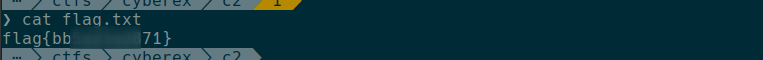

## 03. Where Is My Private Key? ##

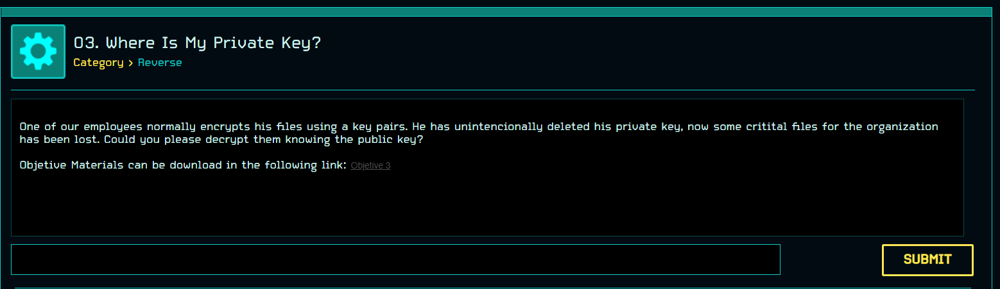

After extracting the zip file we ended up with 3 files.
```
❯ ls
cipher_me.rb
flag.encrypted
publickey.pem
```
The flag.encrypted file was binary data, so it contained a ciphered version of the flag, publickey.pem
contained the public component of the RSA key.
```
-----BEGIN PUBLIC KEY-----
MIIBIjANBgkqhkiG9w0BAQEFAAOCAQ8AMIIBCgKCAQEAlkq3uPjcHZeZfh7/XQrx
1ZGBY2huUlUpjdKgjyBTZ/T/EsWohg4XPO2BTQk/seQ0JNnPJJEokNc3vf8/+amM
OsTmOUkLO9xJbxp480038cNiUHnfKO5VhB+P8uAHkcSbeJzqkEsyKPv/jMQt2sNJ
XFdSnuTo0aMlGxB32qVZpiGwomi2l/ga0g/JGg0OHuPlANn92bfLG9MIxS6+aTfT
jQggP1X3NMu9zAKvBh8e9xbHD5k6aapehiWvYxINN9d05EHx+Ql5mn+Hyn8bQ6l8
dluLTpGs6vLUFe2H8TQ7FinFEnN4+B5mzwwt8EgoTtQ8a1/vJBHSWvS6W7OrOesC
xwIDAQAB
-----END PUBLIC KEY-----
```
Finally cipher\_me.rb contained the code that was used to generate the ciphered version of
the flag and the public key.
```rb
require 'openssl'

def buildFiles(key)
    File.write('publickey.pem', key.to_pem)
    File.binwrite('flag.encrypted', key.public_encrypt(File.binread('flag.txt')))
end

def generateKeys(e)
    p = OpenSSL::BN.generate_prime(1024, false)
    q = OpenSSL::BN.new(e).mod_inverse(p)

    return p,q
end

def constructFiles(p,q,e)
    key = OpenSSL::PKey::RSA.new
    key.set_key(p.to_i * q.to_i, e, nil)
    buildFiles(key)
end

if caller.length == 0
    e = 65537
    while true
        p,q = generateKeys(e)
        next unless q.prime?
        constructFiles(p,q,e)
        break
    end
end
```
As we can see this is an RSA implementation using the openssl library, one thing that caught
our attention was the line:

```
q = OpenSSL::BN.new(e).mod_inverse(p)
```
Ideally each prime number p and q should not depend on each other, in this custom implementation
they derived q from p like q = e^-1 (mod p). We can implement an attack around that, but first of
all we need to extract the modulus from the public key, we can use openssl to achieve this.
```
❯ cat publickey.pem | openssl rsa -pubin -modulus -noout
Modulus=964AB7B8F8DC1D97997E1EFF5D0AF1D5918163686E5255298DD2A08F205367F4FF12C5A8860E173CED814D093FB1E43424D9CF24912890D737BDFF3FF9A98C3AC4E639490B3BDC496F1A78F34D37F1C3625079DF28EE55841F8FF2E00791C49B789CEA904B3228FBFF8CC42DDAC3495C57529EE4E8D1A3251B1077DAA559A621B0A268B697F81AD20FC91A0D0E1EE3E500D9FDD9B7CB1BD308C52EBE6937D38D08203F55F734CBBDCC02AF061F1EF716C70F993A69AA5E8625AF63120D37D774E441F1F909799A7F87CA7F1B43A97C765B8B4E91ACEAF2D415ED87F1343B1629C5127378F81E66CF0C2DF048284ED43C6B5FEF2411D25AF4BA5BB3AB39EB02C7
```
This is the modulus N encoded in hexadecimal, we can convert this to decimal with python.
```
>>> int('964AB7B8F8DC1D97997E1EFF5D0AF1D5918163686E5255298DD2A08F205367F4FF12C5A8860E173CED814D093FB1E43424D9CF24912890D737BDFF3FF9A98C3AC4E639490B3BDC496F1A78F34D37F1C3625079DF28EE55841F8FF2E00791C49B789CEA904B3228FBFF8CC42DDAC3495C57529EE4E8D1A3251B1077DAA559A621B0A268B697F81AD20FC91A0D0E1EE3E500D9FDD9B7CB1BD308C52EBE6937D38D08203F55F734CBBDCC02AF061F1EF716C70F993A69AA5E8625AF63120D37D774E441F1F909799A7F87CA7F1B43A97C765B8B4E91ACEAF2D415ED87F1343B1629C5127378F81E66CF0C2DF048284ED43C6B5FEF2411D25AF4BA5BB3AB39EB02C7', 16)
18972590399331281171210413913982690842630410554091741341028121188197521337187947722346907707072189319369621541577833156860369302710376909963523358190932988382920009183936732951932034740473409280920978845474450265616225733922873647241866272873475629377318244362727603241682187919115686270212261534825007634512528831899610488843025162836385652973081728384021899934347471901561077299245042887864447139565390922146360260372827834003295865567402160298923203671717207288056299637268693227996071112735691949760463353308530403980744617025597358301104336546226599131378779429893721079689050789852993299595343692990531823665863L
```
Now we have all we need to start deriving P and Q from our N and e.
```
import gmpy2

e = 65537
N = 18972590399331281171210413913982690842630410554091741341028121188197521337187947722346907707072189319369621541577833156860369302710376909963523358190932988382920009183936732951932034740473409280920978845474450265616225733922873647241866272873475629377318244362727603241682187919115686270212261534825007634512528831899610488843025162836385652973081728384021899934347471901561077299245042887864447139565390922146360260372827834003295865567402160298923203671717207288056299637268693227996071112735691949760463353308530403980744617025597358301104336546226599131378779429893721079689050789852993299595343692990531823665863

for x in range(1,e):
    delta = 1+4*x*N*e
    if gmpy2.is_square(delta):
        cp = gmpy2.isqrt(delta)
        if (cp-1)%(2*x) == 0:
            p = (cp-1)/(2*x)
            if N%p == 0:
                print("P is: " + str(p))
                print("Q is: " + str(N/p))
                break
```
If we execute this script we get P and Q as following.
```
❯ python get-pq.py
P is: 166112135887929010288416514734452747816488751580526844955018527363291256381213849797714135620632176703820363242692881710406097568863532740710904313043579545959508247895447410718201516884590366390063742391024226082967848911528362615266957924778397193911132203254844236928628888741587960702007771698474381430209
Q is: 114215558652087478243078337228800673239645026835553972372294198392429171232284945902079655451682670043296965201980967020680219855167745126598940600796035544807167869549485805297520435080235761329768716291931789306051500795753407634910961106037263444344773781880003524794816286746012736090359250626007485481607
```
Now that we have P and Q, we can generate the private key with rsatool.

```
❯ ~/hypercube/tools/rsatool/rsatool.py -p 166112135887929010288416514734452747816488751580526844955018527363291256381213849797714135620632176703820363242692881710406097568863532740710904313043579545959508247895447410718201516884590366390063742391024226082967848911528362615266957924778397193911132203254844236928628888741587960702007771698474381430209 -q 114215558652087478243078337228800673239645026835553972372294198392429171232284945902079655451682670043296965201980967020680219855167745126598940600796035544807167869549485805297520435080235761329768716291931789306051500795753407634910961106037263444344773781880003524794816286746012736090359250626007485481607 -o private.key
Using (p, q) to initialise RSA instance

n =
964ab7b8f8dc1d97997e1eff5d0af1d5918163686e5255298dd2a08f205367f4ff12c5a8860e173c
ed814d093fb1e43424d9cf24912890d737bdff3ff9a98c3ac4e639490b3bdc496f1a78f34d37f1c3
625079df28ee55841f8ff2e00791c49b789cea904b3228fbff8cc42ddac3495c57529ee4e8d1a325
1b1077daa559a621b0a268b697f81ad20fc91a0d0e1ee3e500d9fdd9b7cb1bd308c52ebe6937d38d
08203f55f734cbbdcc02af061f1ef716c70f993a69aa5e8625af63120d37d774e441f1f909799a7f
87ca7f1b43a97c765b8b4e91aceaf2d415ed87f1343b1629c5127378f81e66cf0c2df048284ed43c
6b5fef2411d25af4ba5bb3ab39eb02c7

e = 65537 (0x10001)

d =
6093cf0ffc4b6670bedfff075640ec3ab37013f34dc1769c67588c78aceb2c0891c8fc5f5915c0f5
14225ce0ae9f9fe7aa2e9520086faaf3c20c43f456790f75cc85ad163533d851102650c6f83e150b
db279fc939c23e0dd3426b6e6f2ecacaa56d20866cebe4ce5adf98496724cb059dcfa7efad74d983
c4aa867a687afd77f4444934fe32f12960db810e98458b5d4c7ef9f112beaf81be1f08f1822ba2cd
d0fd62bef3477f6dcc1361884fd27889b74b9ac63d64ec6b97c55ab13ff4dba7f7cb46f50dcf87c1
bc8e9ed369e6a1c47727edabbc7586ddb23ce16e7fbb970a53b684092e40525ee8e7372843393ed2
ae588107b5d8e816e26d8a38bc9ea501

p =
ec8d314d3618cf21fe66e1c7287c41235bdc564c63804a7e08d1268450a3230cb9c3ee23e99e57a8
da3ad1efe4578b8d88abf2fb0b4ffa24bdaff6f975b735a6f115af6b9a3334c8a336551f073120e8
85a89dfb2692420121256deb56154799126296c76841e945bcc93476ed9dfc4276d800453503d84e
ccfb8eed85b34dc1

q =
a2a5fa8e4272108a29288879ae06b1ab24507e2e0c047c33e8d01691c7f843f34e0fc0408533d0c6
53373a7e9e1cebe1a765c3ae85fab9de65670684444272eb94bcfa5f1c29b5537795b6359d765450
4d06c1899cddd7f07ae0079257204e989ba19a570602bbe8ad841344eae144405702f23ca3d53ef7
ffcdc05ae5218287

Saving PEM as private.key
```
Now with our private key we should be able to decrypt our encrypted flag.

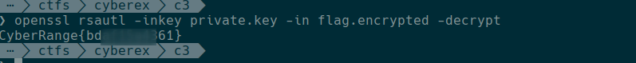

## 4. Protected ##

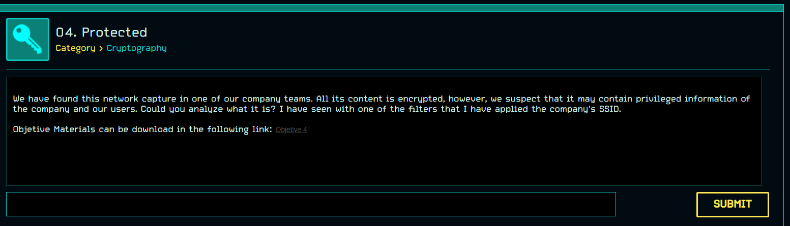

After unzipping the file provided in the challenge, we had two files.
```
❯ unzip -d c4 Objective_4_v1.0.zip
Archive:  Objective_4_v1.0.zip
  inflating: c4/Capture.cap
 extracting: c4/Compressed.zip
```
If we attempt to decrypt the zip file, it asks for a password.
```
❯ unzip Compressed.zip
Archive:  Compressed.zip
[Compressed.zip] music.wav password:
```
Opening the cap file in wireshark reveals encrypted wireless traffic for an SSID called
cyberRange.

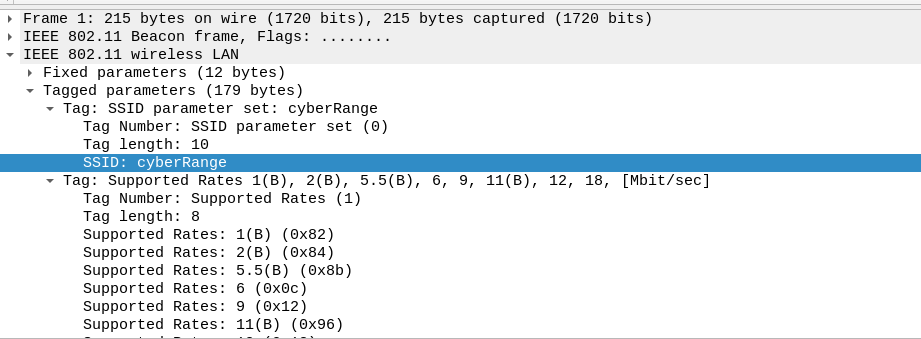

We ran aircrack-ng with the rockyou password list and after a few seconds we found the password
cyberman for this SSID.
```
aircrack-ng -e cyberRange -w ../rockyou.txt Capture.cap
```

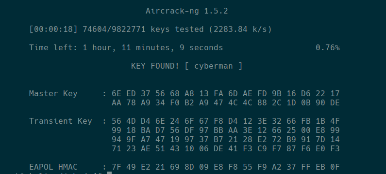

Luckily wireshark has an option to decrypt the traffic using the PSK of the wireless network, and
after applying our WPA passphrase we are able to see the traffic decrypted.


If we follow stream 38 we are able to see a post to the url http://test.php.vulnweb.com/userinfo.php,
this post contained a user and password.

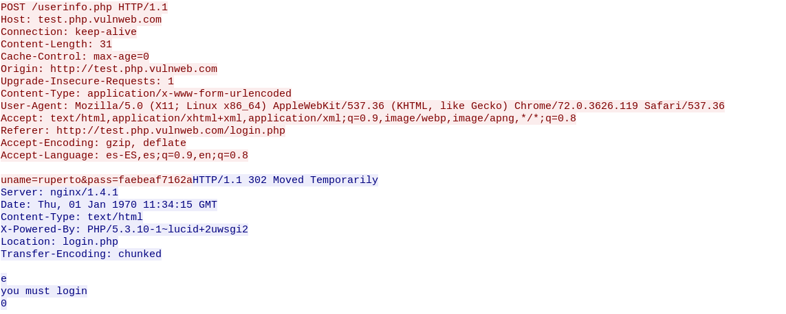

We were able to use this password with our zip file.

```
❯ unzip Compressed.zip
Archive:  Compressed.zip
[Compressed.zip] music.wav password:
  inflating: music.wav
```
We have an audio file, the file had some noises but nothing understandable opening the file
in audacity and switching the display to spectrogram revealed the flag.

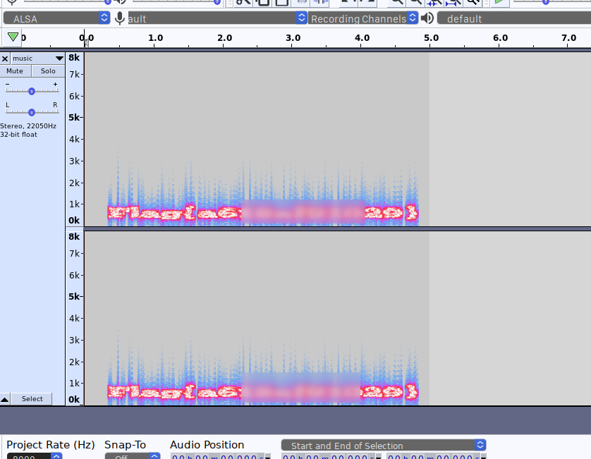

## 5. Rogue User ##

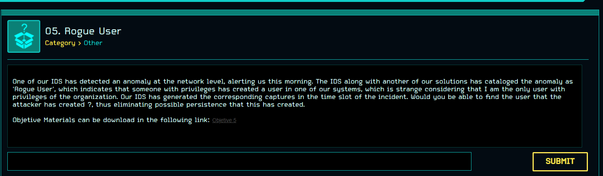

After unzipping the file we ended with a packet capture file.

```
unzip -d c5 Objective_5_v1.0.zip
Archive:  Objective_5_v1.0.zip
  inflating: c5/Rogue_User.cap
```
After opening the file in wireshark we quickly found a conversation between host 192.168.1.137
and 192.168.1.198.

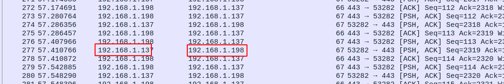

Following the TCP stream we find what it seems like a shell session in which the attacker
performed the following actions:

* Verified the current user
* Checked the content of /etc/shadow
* Added a new user attacker with password fernanda
* Displayed the content of /etc/shadow again and exited the shell

At some points it seems that there are some ASCII escape codes messing with the output of the
shell but it is pretty clear that the user created by the attacker is *attacker*.

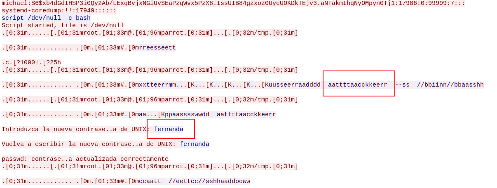

At this point we ran into problems, we were pretty sure we had our flag *attacker* but the
CTF platform did not accept our flag, we started to throw everything at it like, user:password,
the line of /etc/shadow for the user attacker, etc. This is were not having a predefined format
for flags really hurts the competitions since you are spending time guessing things, at the
end we were able to get a working flag with the concatenation of user and password as *attackerfernanda*.

## 6. Undercover Channel ##

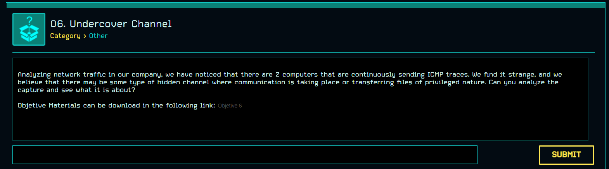

We started unzipping the file and again we had a packet capture file.

```
❯ unzip -d c6 Objective_6_v1.0.zip
Archive:  Objective_6_v1.0.zip
  inflating: c6/suspiciousCapture.cap
```

Since the description of the problem is pretty clear on some sort of channel communication over
ICMP, we will start to filter ICMP packets.

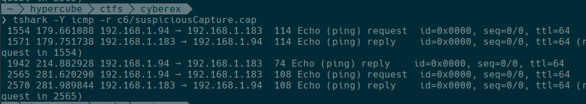

It seems like there is an exchange of ICMP packets between hosts 192.168.1.94 and 192.168.1.183,
if we display only the data portion of those packets we get.

```
❯ tshark -V -Y icmp -r c6/suspiciousCapture.cap -T fields -e data
343836393230363236663632326332303634366632303739366637353230373236353633363536393736363532303664373932303664363537333733363136373635373333663061
343836393230363236663632326332303634366632303739366637353230373236353633363536393736363532303664373932303664363537333733363136373635373333663061
3539363537333263323034393230373336353635323037343638363536643061
353036353732363636353633373432633230373436383635323036363663363136373230363937333230363633313338363133393634363233313336363133353061
353036353732363636353633373432633230373436383635323036363663363136373230363937333230363633313338363133393634363233313336363133353061
```

It seems there are a couple of duplicated lines, we removed those with uniq and ended with.

```
❯ tshark -V -Y icmp -r c6/suspiciousCapture.cap -T fields -e data | uniq
343836393230363236663632326332303634366632303739366637353230373236353633363536393736363532303664373932303664363537333733363136373635373333663061
3539363537333263323034393230373336353635323037343638363536643061
353036353732363636353633373432633230373436383635323036363663363136373230363937333230363633313338363133393634363233313336363133353061
```
This seems to be straight ASCII chars, if we concatenate and decode them we are able to recover the flag.

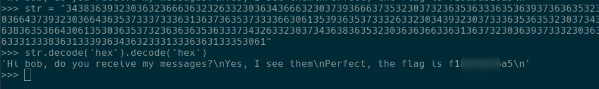
