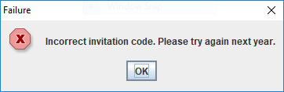

# Challenge 1
## MinesweeperChampionshipRegistration

After extracting our 7z file, we were left with a file called
MinesweeperChampionshipRegistration.jar.

```
sha256sum MinesweeperChampionshipRegistration.jar
9bcce226836b5226f9ecb17b13a2842dfc21931e15864cc4d85079f948f7a70e  MinesweeperChampionshipRegistration.jar
```
Once the jar file was executed, a form appeared asking for an invitation code.


If we entered a random code, we got a failure message ...



It was time to open this JAR file in **jd-gui** to disassemble the java bytecode, luckily for us
this JAR file was very small and only had one class called InviteValidator as shown below.


After inspecting the InviteValidtor class we clearly saw our "secret" flag, according to the
challenge rules it was in an email format similar to [stuff]@flare-on.com.

```java
import javax.swing.JOptionPane;

public class InviteValidator
{
  public static void main(String[] args)
  {
    String response = JOptionPane.showInputDialog(null, "Enter your invitation code:", "Minesweeper Championship 2018", 3);
    if (response.equals("Golden[REDACTED]@flare-on.com")) {
      JOptionPane.showMessageDialog(null, "Welcome to the Minesweeper Championship 2018!\nPlease enter the following code to the ctfd.flare-on.com website to compete:\n\n" + response, "Success!", -1);
    } else {
      JOptionPane.showMessageDialog(null, "Incorrect invitation code. Please try again next year.", "Failure", 0);
    }
  }
```
This challenge was pretty easy to resolve, but as we will see in the next challenges the complexity
started to raise in an exponential manner.
