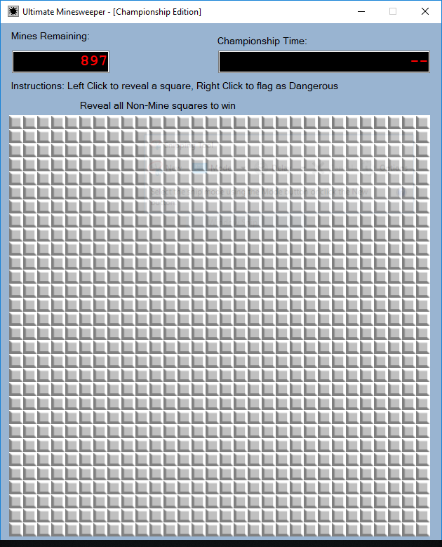
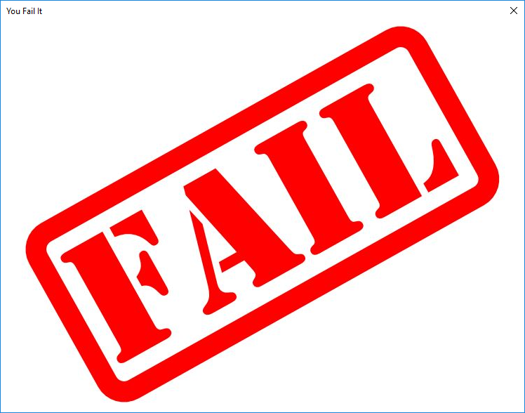
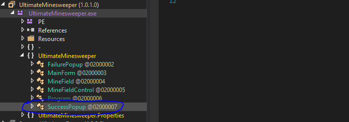
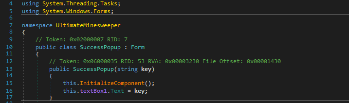
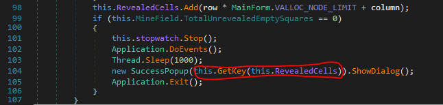
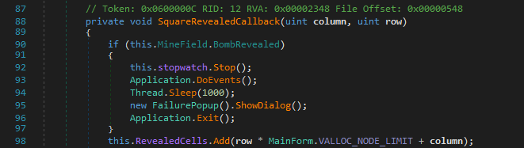
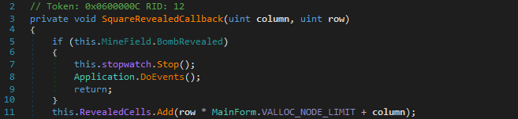
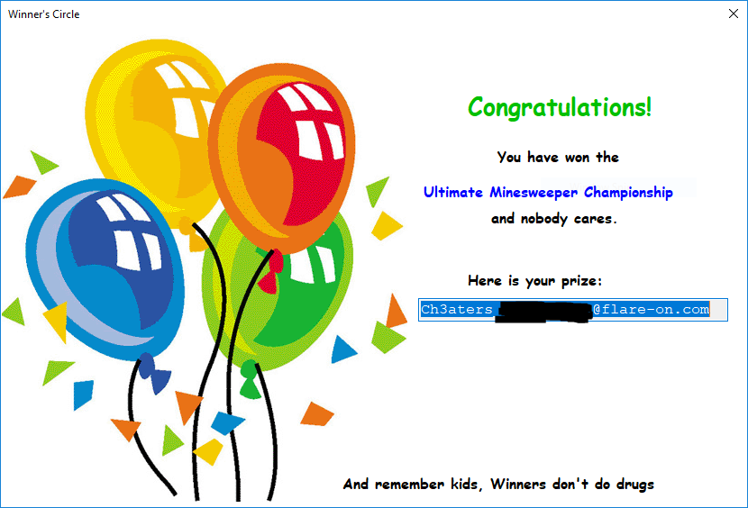

# Challenge 2
## MinesweeperChampionshipRegistration

After extracting the 7z file an EXE file was recovered ...

```
> sha256sum UltimateMinesweeper.exe
77706a2f776fa81441b2b2931c78eca2f5b139b93f6d873deb214195d023dd27  UltimateMinesweeper.exe

> file UltimateMinesweeper.exe
UltimateMinesweeper.exe: PE32 executable (GUI) Intel 80386 Mono/.Net assembly, for MS Windows
```

This binary was a Minesweeper game, and once opened it revealed a 30 x 30 grid with 897 mines :(,
winning on this game was almost impossible ...



After trying a couple of times it was obvious that this game was not meant to be won since I
always got this remainder after blowing a mine on the first try.



Once I tried to reverse the binary is when the fun started, radare2 did not have support for MSIL
at the moment and that meant I have to find another disassembler, but thanks to the FLARE VM this
was an easy task since there is a folder for dotNET tools, I really liked **dnSpy** and started to use it.

There where different classes on this binary, the most interesting one was the SuccessPopup one
since this code was nearly impossible to hit during normal gameplay.



After inspecting the code in the SuccessPopup class, there where some references to a prize. That
was a strong hint that this code would reveal the flag for this challenge, however, no string with
an email format was found.

Inspecting the different elements of the pop-up message, a reference to a key variable was found.



This variable was passed as an argument to the SuccessPopup constructor in a method called
SquareRevealedCallback that was called every time a cell was clicked.



The argument **this.GetKey(this.RevealedCells))** was a call to the GetKey method that used a list
of calculated numbers (line 98) that were added every time a free cell was found (not a mine) to
generate a key at runtime.

```cs
private string GetKey(List<uint> revealedCells)
{
	revealedCells.Sort();
	Random random = new Random(Convert.ToInt32(revealedCells[0] << 20 | revealedCells[1] << 10 | revealedCells[2]));
	byte[] array = new byte[32];
	byte[] array2 = new byte[]
	{
		245,
		75,
		65,
		142,
		68,
		71,
		100,
		185,
		74,
		127,
		62,
		130,
		231,
		129,
		254,
		243,
		28,
		58,
		103,
		179,
		60,
		91,
		195,
		215,
		102,
		145,
		154,
		27,
		57,
		231,
		241,
		86
	};
	random.NextBytes(array);
	uint num = 0u;
	while ((ulong)num < (ulong)((long)array2.Length))
	{
		byte[] array3 = array2;
		uint num2 = num;
		array3[(int)num2] = (array3[(int)num2] ^ array[(int)num]);
		num += 1u;
	}
	return Encoding.ASCII.GetString(array2);
}
```
Since the SquareRevealedCallback method had logic to display the FailurePopup and exit the program
every time a bomb was found, we had to find a way to bypass this check to win the game.



Removing the FailurePopup display and the exit would allow us to continue playing even after
discovering a bomb, this is how the SquareRevealedCallback method ended after the modification.



With the new modifications it is possible to discover where the free cells are located, however, if
one bomb is discovered it will not be possible to open the SuccessPopup due to the checks in place.

Now that the locations of the free cells are well known (after 900 clicks of course, I'm sure there
are clever ways), it is just a matter of launching the game again and have an ezwin.


