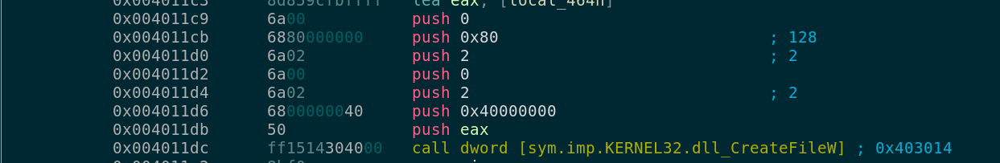
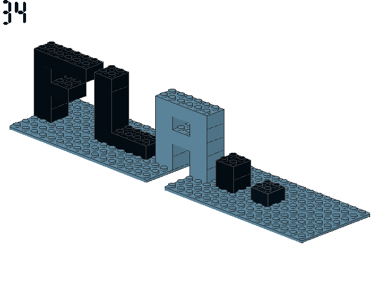

# Challenge 3
## FLEGGO

After extracting the 7z file that was provided a zip file was found.

```
> sha256sum FLEGGO.zip
72d8e33b77d8d9a144552be31e552a38c0f2fe4c91fb4b48eeb5bb0bea4ff5d7  FLEGGO.zip

> file FLEGGO.zip
FLEGGO.zip: Zip archive data, at least v2.0 to extract
```
To verify that nothing funky was going on in that zip file I ran binwalk, it seemed that there were
just some binary files archived in the zip file, nothing strange going on.

```
> binwalk FLEGGO.zip

DECIMAL       HEXADECIMAL     DESCRIPTION
--------------------------------------------------------------------------------
0             0x0             Zip archive data, at least v2.0 to extract, compressed size: 28647, uncompressed size: 45056, name: d4NlRo5umkvWhZ2FmEG32rXBNeSSLt2Q.exe
28713         0x7029          Zip archive data, at least v2.0 to extract, compressed size: 16715, uncompressed size: 45056, name: cWvFLbliUfJl7KFDUYF1ABBFYFb6FJMz.exe
45494         0xB1B6          Zip archive data, at least v2.0 to extract, compressed size: 36674, uncompressed size: 45056, name: Bl0Iv5lT6wkpVCuy7jtcva7qka8WtLYY.exe
82234         0x1413A         Zip archive data, at least v2.0 to extract, compressed size: 29433, uncompressed size: 45056, name: wmkeAU8MdYrC9tEUMHH2tRMgaGdiFnga.exe
[removed for sake of brevity]
```
Binwalk can also be used to extract the files if you don't want to use a zip utility with the -e
flag `binwalk -e FLEGGO.zip`, this will create a folder called \_FLEGGO.zip.extracted with the
following files.

```
> ls -lh
total 3.3M
-rw-r--r-- 1 foobar foobar  44K Jun  2 16:38 1BpnGjHOT7h5vvZsV4vISSb60Xj3pX5G.exe
-rw-r--r-- 1 foobar foobar  44K Jun  2 16:38 1JpPaUMynR9GflWbxfYvZviqiCB59RcI.exe
-rw-r--r-- 1 foobar foobar  44K Jun  2 16:38 2AljFfLleprkThTHuVvg63I7OgjG2LQT.exe
-rw-r--r-- 1 foobar foobar  44K Jun  2 16:38 3Jh0ELkck1MuRvzr8PLIpBNUGlspmGnu.exe
-rw-r--r-- 1 foobar foobar  44K Jun  2 16:38 4ihY3RWK4WYqI4XOXLtAH6XV5lkoIdgv.exe
-rw-r--r-- 1 foobar foobar  44K Jun  2 16:38 7mCysSKfiHJ4WqH2T8ERLE33Wrbp6Mqe.exe
-rw-r--r-- 1 foobar foobar  44K Jun  2 16:38 AEVYfSTJwubrlJKgxV8RAl0AdZJ5vhhy.exe
-rw-r--r-- 1 foobar foobar  44K Jun  2 16:38 aSfSVMn7B8eRtxgJgwPP5Y5HiDEidvKg.exe
-rw-r--r-- 1 foobar foobar  44K Jun  2 16:38 azcyERV8HUbXmqPTEq5JFt7Ax1W5K4wl.exe
-rw-r--r-- 1 foobar foobar  44K Jun  2 16:38 BG3IDbHOUt9yHumPceLTVbObBHFneYEu.exe
-rw-r--r-- 1 foobar foobar  44K Jun  2 16:38 Bl0Iv5lT6wkpVCuy7jtcva7qka8WtLYY.exe
-rw-r--r-- 1 foobar foobar  44K Jun  2 16:38 bmYBZTBJlaFNbbwpiOiiQVdzimx8QVTI.exe
-rw-r--r-- 1 foobar foobar  44K Jun  2 16:38 Bp7836noYu71VAWc27sUdfaGwieALfc2.exe
-rw-r--r-- 1 foobar foobar  44K Jun  2 16:38 cWvFLbliUfJl7KFDUYF1ABBFYFb6FJMz.exe
-rw-r--r-- 1 foobar foobar  44K Jun  2 16:38 d4NlRo5umkvWhZ2FmEG32rXBNeSSLt2Q.exe
-rw-r--r-- 1 foobar foobar  44K Jun  2 16:38 dnAciAGVdlovQFSJmNiPOdHjkM3Ji18o.exe
-rw-r--r-- 1 foobar foobar  44K Jun  2 16:38 dT4Xze8paLOG7srCdGLsbLE1s6m3EsfX.exe
-rw-r--r-- 1 foobar foobar  44K Jun  2 16:38 E36RGTbCE4LDtyLi97l9lSFoR7xVMKGN.exe
-rw-r--r-- 1 foobar foobar  44K Jun  2 16:38 eEJhUoNbuc40kLHRo8GB7bwFPkuhgaVN.exe
-rw-r--r-- 1 foobar foobar  44K Jun  2 16:38 eovBHrlDb809jf08yaAcSzcX4T37F1NI.exe
-rw-r--r-- 1 foobar foobar  44K Jun  2 16:38 Ew93SSPDbgiQYo4E4035A16MJUxXegDW.exe
-rw-r--r-- 1 foobar foobar  44K Jun  2 16:38 gFZw7lPUlbOXBvHRc31HJI5PKwy745Wv.exe
-rw-r--r-- 1 foobar foobar  44K Jun  2 16:38 hajfdokqjogmoWfpyp4w0feoeyhs1QLo.exe
-rw-r--r-- 1 foobar foobar  44K Jun  2 16:38 HDHugJBqTJqKKVtqi3sfR4BTq6P5XLZY.exe
-rw-r--r-- 1 foobar foobar  44K Jun  2 16:38 iJO15JsCa1bV5anXnZ9dTC9iWbEDmdtf.exe
-rw-r--r-- 1 foobar foobar  44K Jun  2 16:38 IXITujCLucnD4P3YrXOud5gC7Bwcw6mr.exe
-rw-r--r-- 1 foobar foobar  44K Jun  2 16:38 JIdE7SESzC1aS58Wwe5j3i6XbpkCa3S6.exe
-rw-r--r-- 1 foobar foobar  44K Jun  2 16:38 jJHgJjbyeWTTyQqISuJMpEGgE1aFs5ZB.exe
-rw-r--r-- 1 foobar foobar  44K Jun  2 16:38 JXADoHafRHDyHmcTUjEBOvqq95spU7sj.exe
-rw-r--r-- 1 foobar foobar  44K Jun  2 16:38 K7HjR3Hf10SGG7rgke9WrRfxqhaGixS0.exe
-rw-r--r-- 1 foobar foobar  44K Jun  2 16:38 kGQY35HJ7gvXzDJLWe8mabs3oKpwCo6L.exe
-rw-r--r-- 1 foobar foobar  44K Jun  2 16:38 lk0SOpnVIzTcC1Dcou9R7prKAC3laX0k.exe
-rw-r--r-- 1 foobar foobar  44K Jun  2 16:38 MrA1JmEDfPhnTi5MNMhqVS8aaTKdxbMe.exe
-rw-r--r-- 1 foobar foobar  44K Jun  2 16:38 NaobGsJ2w6qqblcIsj4QYNIBQhg3gmTR.exe
-rw-r--r-- 1 foobar foobar  44K Jun  2 16:38 P2PxxSJpnquBQ3xCvLoYj4pD3iyQcaKj.exe
-rw-r--r-- 1 foobar foobar  44K Jun  2 16:38 PvlqINbYjAY1E4WFfc2N6rZ2nKVhNZTP.exe
-rw-r--r-- 1 foobar foobar  44K Jun  2 16:38 SDIADRKhATsagJ3K8WwaNcQ52708TyRo.exe
-rw-r--r-- 1 foobar foobar  44K Jun  2 16:38 SeDdxvPJFHCr7uoQMjwmdRBAYEelHBZB.exe
-rw-r--r-- 1 foobar foobar  44K Jun  2 16:38 u3PL12jk5jCZKiVm0omvh46yK7NDfZLT.exe
-rw-r--r-- 1 foobar foobar  44K Jun  2 16:38 u8mbI3GZ8WtwruEiFkIl0UKxJS917407.exe
-rw-r--r-- 1 foobar foobar  44K Jun  2 16:38 v6RkHsLya4wTAh71C65hMXBsTc1ZhGZT.exe
-rw-r--r-- 1 foobar foobar  44K Jun  2 16:38 w3Y5YeglxqIWstp1PLbFoHvrQ9rN3F3x.exe
-rw-r--r-- 1 foobar foobar  44K Jun  2 16:38 wmkeAU8MdYrC9tEUMHH2tRMgaGdiFnga.exe
-rw-r--r-- 1 foobar foobar  44K Jun  2 16:38 x4neMBrqkYIQxDuXpwJNQZOlfyfA0eXs.exe
-rw-r--r-- 1 foobar foobar  44K Jun  2 16:38 xatgydl5cadiWFY4EXMRuoQr22ZIRC1Y.exe
-rw-r--r-- 1 foobar foobar  44K Jun  2 16:38 xyjJcvGAgswB7Yno5e9qLF4i13L1iGoT.exe
-rw-r--r-- 1 foobar foobar  44K Jun  2 16:38 y77GmQGdwVL7Fc9mMdiLJMgFQ8rgeSrl.exe
-rw-r--r-- 1 foobar foobar  44K Jun  2 16:38 zRx3bsMfOwG8IaayOeS8rHSSpiRfc9IB.exe
```
### Running the binary

Since these are windows binaries, they can be executed in wine.

```
wine 1BpnGjHOT7h5vvZsV4vISSb60Xj3pX5G.exe
What is the password?
randompass
Go step on a brick!
```
It seemed like a password was required, at that point it was necessary to disassemble the
binary and it was time to fire up radare2!.

### Static Analysis

Digging in the main function of the binary a routine that was attempting to locate a resource
called BRICK somewhere in the binary caught my attention.


A quick listing of all the strings in the binary revealed that the string **BRICK** had a copy
in the **.rsc** section at address 0x0040e0a2.


This was very interesting, after dumping a few more bytes on that location a new string was
revealed as well (note the 16 bit wide strings).


It was time to start a dynamic analysis to check if that string was the password we needed,
in retrospective I should have tested this string as password right away however it was nice
to understand what was happening under the hood.

### Debugging the binary

During runtime, **FindResourceW** returned the address 0x00A9E080 (0x0040e080 using radare2 base address)
as the pointer to the BRICK resource, that same pointer is passed to **LoadResource** as an HRSRC 
pointer for the function **LoadResource**, according to the MDSN documentation.

```c
HGLOBAL WINAPI LoadResource(
  _In_opt_ HMODULE hModule,
  _In_     HRSRC   hResInfo
);
```


The **LoadResource** returns a handle to the data associated with the resource, in our case a
pointer to the string at address 0x00A9E0B0.


After being asked for the password the function IronManSucks at address 0x401240 is called, it is
possible to think that the password required is IronManSucks since we enter a loop to test that
string against the password provided by the user.


This was a distraction since the real comparison was further down the code, first the pointer to
the string loaded by the **LoadResource** function was moved to EAX and then it was compared
against the string provided by the user that was loaded in the pointer held in ECX.


In the following image the state of the registers during runtime can be seen.


And as stated before, the address 0x00A94380 contained the resource that was loaded from the
binary.


After successfully comparing the user input string with the stored secret, we returned from the
**IronManSucks** function with EAX set to 1.


In function **fcn.00401080** a file name was decoded from memory at address 0x00A943A0 using the
key 0x85, per example:

The first byte 0xB2 xored with the key 0x85 results in 0x37, that is the first byte that of the
filename (number 7) as shown below.


At the end of the execution of this function at address 0x00A943A0 the file name **73903128.png**,
was decoded in memory.

Function **fcn.00401080** was also a decoding routine, the decoding took place at address
0x00A943C0 with the key 0x0A.


This function decoded a character (u) at address 0x00A943C0.

Function **fcn.00401540** did several things:

* Calculate the length of the password.


* Copy ASCII 256 chars to address 00xBEF8E8.


* Use the ASCII table to decode binary data with the key string at address 0x00A943D0.


At address 0x004011dc a file handler is created for the file **73903128.png** in the current
directory.



And the decoded PNG file at memory 0x00A943D0 is saved to that new file and after that the file
is closed.


After that a message with the string "Everything is awesome!" is displayed, along with our
decoded character and the png file name that was created, this was confirmed after testing the
binary with the secret discovered.

```
foobar@higgs:~/fleggo$ wine x4neMBrqkYIQxDuXpwJNQZOlfyfA0eXs.exe 
What is the password?
Fs3Ogu6W3qk59kZ
Everything is awesome!
73903128.png => u
foobar@higgs:~/fleggo$ ls -l
total 68
-rw-r--r-- 1 foobar foobar 21926 Oct 22 00:38 73903128.png
-rw-r--r-- 1 foobar foobar 45056 Oct 22 00:37 x4neMBrqkYIQxDuXpwJNQZOlfyfA0eXs.exe
```
The new file contained this lovely image, mad props to the challenge designer for taking the time
to do something like this.



### Automating the process

Since there were 48 binaries, doing this by hand would take a considerable amount of time. To verify
if it was possible to automate this tasks a random file was analyzed at address 0x0040E0B0.

```
> r2 1BpnGjHOT7h5vvZsV4vISSb60Xj3pX5G.exe
 -- This is fine.
[0x004018e9]> psw @0x0040e0b0
ZImIT7DyCMOeF6
[0x004018e9]>
```
The `psw` command in radare2 prints a 16 bit wide string, since as explained before this is the
format used to store these strings in the binaries.

Creating a script with r2pipe to extract the secret passwords was pretty easy, also wine could
be used to avoid manually executing each binary to extract the png file.

```python
import re
import r2pipe
from subprocess import PIPE, run
from os import listdir
from os.path import isfile, join

def get_secret(f):
    r = r2pipe.open(f)
    key = r.cmd('psw @0x0040e0b0')
    return key

if __name__ == '__main__':
    mypath = './'
    onlyfiles = [f for f in listdir(mypath) if isfile(join(mypath, f))]

    exe = re.compile('.*exe')
    for f in onlyfiles:
        if (exe.match(f)):
            key = get_secret(f)
            p = run(['wine',f], stdout=PIPE, input=bytes(key, 'ascii'))
            rex = re.compile('.*?(?P<info>\d+\.png\s=>\s.?).*', re.DOTALL)
            png, char = rex.match(p.stdout.decode('ascii')).group('info').split(' => ')
            print ('[+] file {}: key=>{}, png=>{}, char=>{}'.format(f,key,png,char))
```
Here is a snippet of the results after running this script.
```
foobar@higgs:~/fleggo$ python3 get-all.py
[+] file 1JpPaUMynR9GflWbxfYvZviqiCB59RcI.exe: key=>PylRCpDK, png=>85934406.png, char=>m
[+] file E36RGTbCE4LDtyLi97l9lSFoR7xVMKGN.exe: key=>dPVLAQ8LwmhH, png=>60075496.png, char=>s
[+] file kGQY35HJ7gvXzDJLWe8mabs3oKpwCo6L.exe: key=>14bm9pHvbufOA, png=>82236857.png, char=>e
[+] file d4NlRo5umkvWhZ2FmEG32rXBNeSSLt2Q.exe: key=>5xj9HmHyhF, png=>18309310.png, char=>@
[+] file Bp7836noYu71VAWc27sUdfaGwieALfc2.exe: key=>NcMkqwelbRu, png=>47619326.png, char=>p
[+] file 2AljFfLleprkThTHuVvg63I7OgjG2LQT.exe: key=>UvCG4jaaIc4315, png=>67782682.png, char=>m
[+] file eovBHrlDb809jf08yaAcSzcX4T37F1NI.exe: key=>rXZE7pDx3, png=>33718379.png, char=>.
[+] file u8mbI3GZ8WtwruEiFkIl0UKxJS917407.exe: key=>r6ZWNWeFadW, png=>36494753.png, char=>0
[+] file y77GmQGdwVL7Fc9mMdiLJMgFQ8rgeSrl.exe: key=>8Etmc0DAF8Qv, png=>12268605.png, char=>s
[+] file SDIADRKhATsagJ3K8WwaNcQ52708TyRo.exe: key=>5O2godXTZePdWZd, png=>87730986.png, char=>0
```
From this output it is obvious that each character is correlated to the number on the top left
corner of each image, at this point it was just a matter of sorting the images to create our flag.


