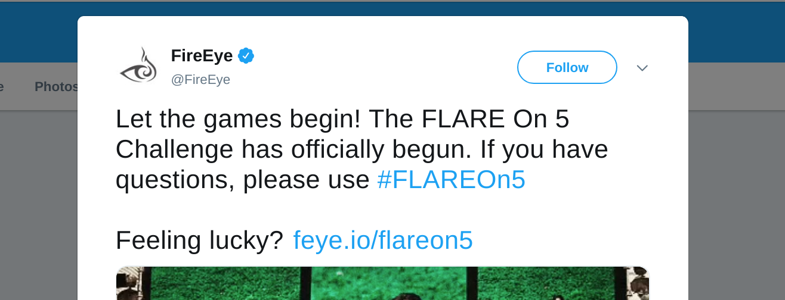

# Flare-On 5

While surfing twitter for news as usual, I found a reference for the start of 5th FireEye Labs
Advanced Reverse Engineering (FLARE) team's annual reverse engineering challenge.

This immediately caught my attention since I enjoy doing CTFs, although, once I started to read
about previous FLARE challenges I realized that this was a totally different level, a far cry from
the usual small Linux binaries I get to reverse during the CTFs I play since most of the challenges
are for Windows systems.

I decided to give it a chance even though by the time a registered several days had passed, luckiely
for me Peter Kacherginsky from the FLARE team built a custom VM with a lot of tools withe reverse
engineering tasks in mind and can be obtained at https://github.com/fireeye/flare-vm.

I was able to complete 6/12 challenges, sadly I had some projects at work and couldn't sink in more time
for the challenge, however, I had a ton of fun and learned a lot in the process and here is my
writeups.
